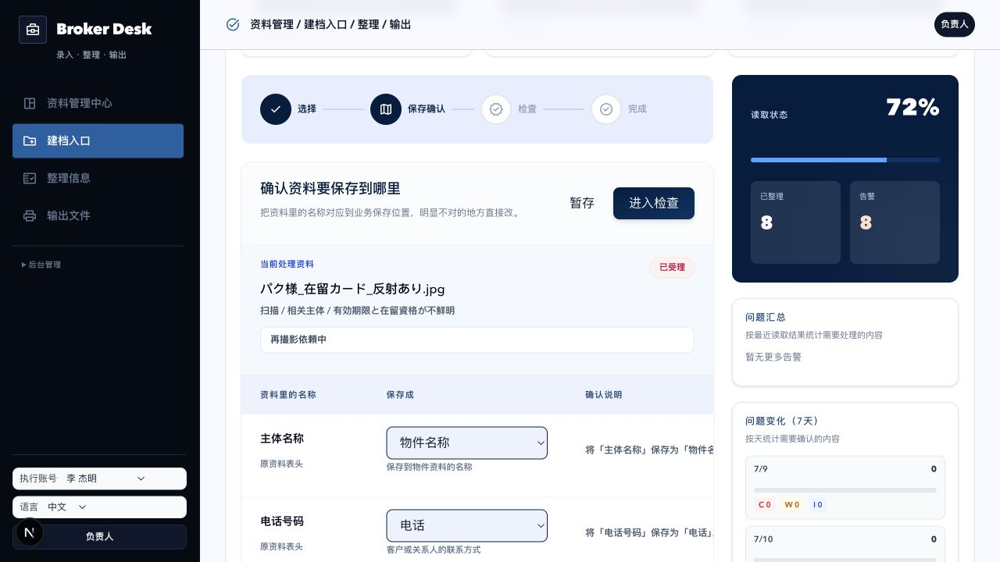
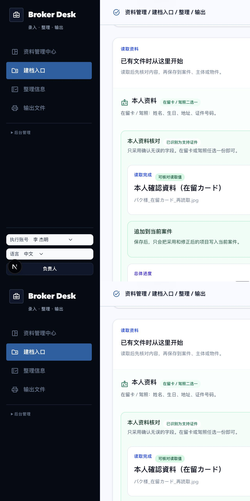

# P0 资料提取核对审计

日期：2026-07-15  
范围：仅开发分支 `dev/friend-test-fixes-20260702`，未合并到主测试环境。

## 审计目标

1. 证件图片、PDF 和普通手动资料不得进入 Excel 列匹配。
2. 读取结果应以“值、来源、确认状态”为核心，不展示内部映射和运维统计。
3. 用户能同时看到总体完成度、已填值、未填值和当前要处理的项。
4. 右侧修改要即时反映到左侧，不依赖 Enter；确认后进度条必须有可见增长。

## 修复前证据

主要问题：

- `scan` 资料被当成批量表格。
- “主体名称”会默认映射到“物件名称”，有污染事实的风险。
- 主界面同时展示问题趋势、C/W/I 统计、附件注册等内部能力，与经纪人当前任务无关。

## 实施结果

### 1. 资料分流

- 只有普通 Excel 批量任务可进入列匹配。
- 已归属的图片、PDF 和手动记录直接进入对应案件。
- 历史旧链接保留兼容页，明确说明“无需 Excel 列匹配”，不再展示错误映射。

### 2. 双栏核对

- 左栏：所有已读取和手动值的宏观索引、状态和总进度。
- 右栏：默认只处理未确认项，可切换到全部项。
- 未读取项直接显示填写框；读取值可原地修改。
- 输入时左栏即时回显，确认后待处理数减少，进度条以 500ms 过渡增长。
- 来源信息收入按需展开的“查看来源”，不再与业务值抢主层级。

### 3. 可重复验收数据

新增开发模拟资料 `import_demo_019`，包含：

- 7 个可读取值。
- 3 个未读取值。
- 1 个低置信度需仔细核对值。
- 明确关联到 `case_demo_park_ikebukuro_share`。

开发验收地址：

`http://localhost:3001/import-center?xlsxJob=import_demo_019#source-upload`

## 修复后证据

注：应用内浏览器的长页截图会分段拼接 sticky 导航；布局和交互验收同时使用 DOM 快照、实时输入与状态断言完成，不仅依赖该长图。

## 交互验收

- 手动填写“勤務先名”时，左栏在未提交前已即时显示新值。
- 确认该项后，进度从 `0/10` 变为 `1/10`，待处理从 10 变为 9。
- 批量确认已读取值后，进度为 `8/10`，右栏只剩 2 个未读取项。
- 旧证件记录 `import_demo_015` 不再显示列匹配，指向已归属案件。
- 发现并修复日文标签在服务端和浏览器中排序不同导致的 hydration 错误。

## 验证结果

- `npx tsc --noEmit`：通过。
- `npm run lint`：通过。
- `npm run test:ja-terms`：通过。
- `git diff --check`：通过。
- `BASE_URL=http://localhost:3001 npm run test:regression`：通过。
- 开发服务仍运行于 `http://localhost:3001`。

## 结论

P0 第 2 项的核心产品边界已落地：资料类型先正确分流，再围绕候选值、来源和人工确认完成核对。该检查点仅存在于开发分支，不代表已准入主测试环境或真实试点。
