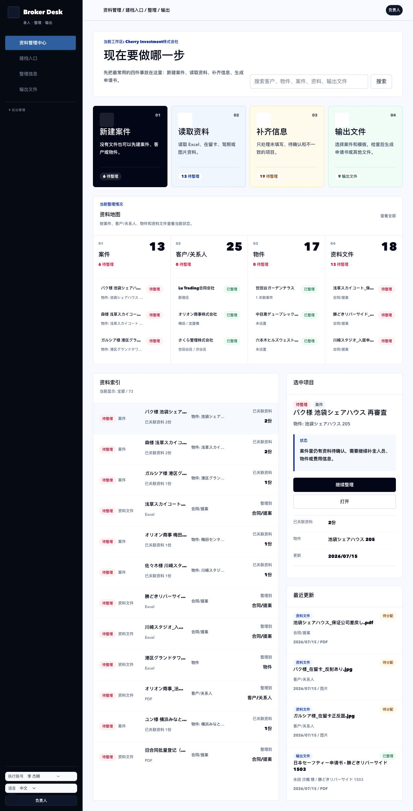
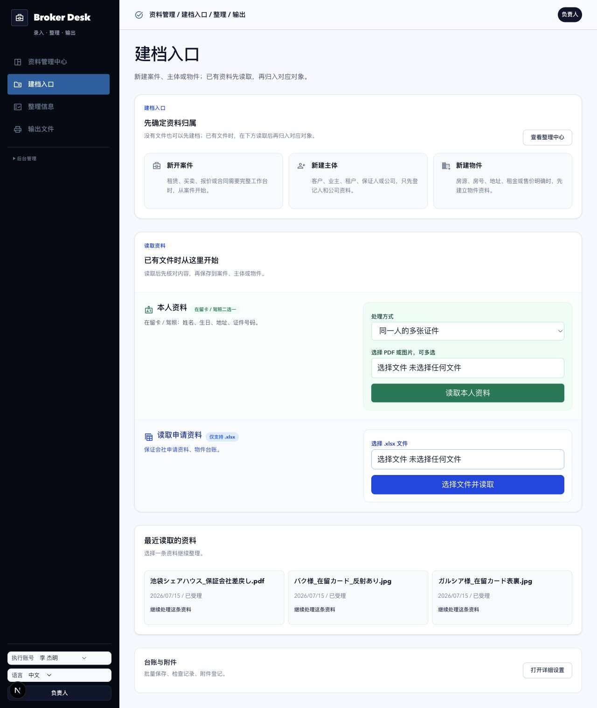
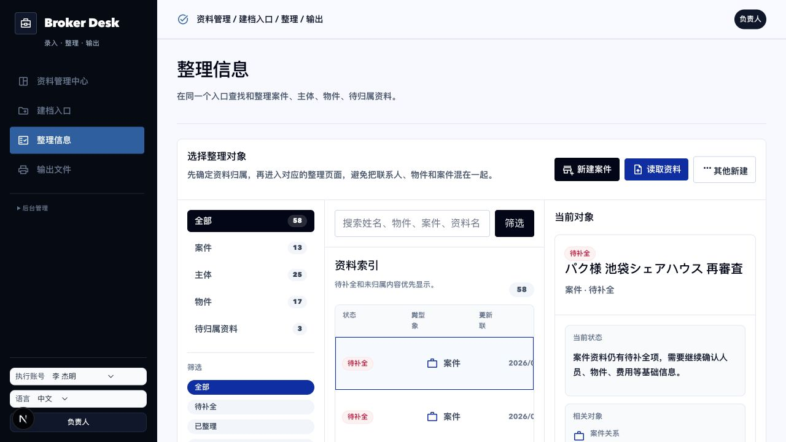
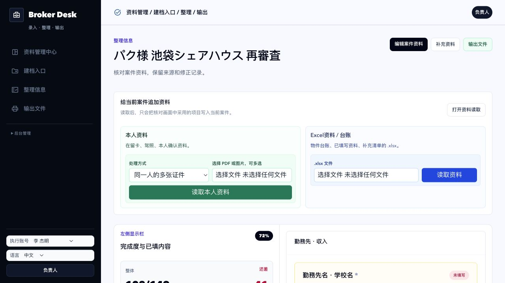
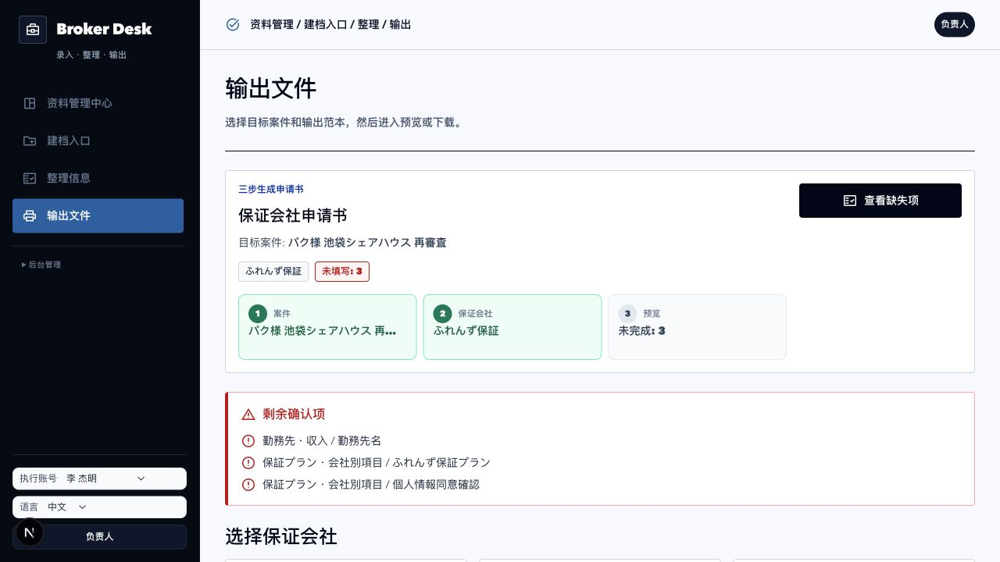
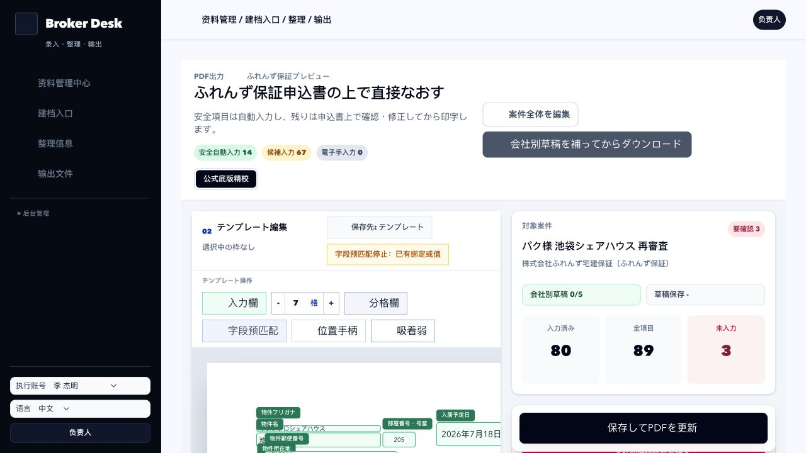
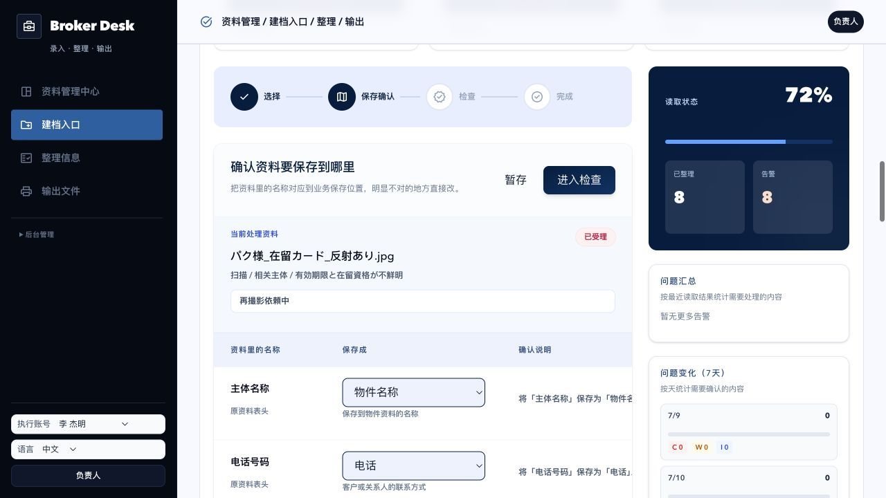

# Broker Desk 全产品设计审计

日期：2026-07-15  
环境：本地开发环境，日文 UI，演示账号与全量模拟数据  
审计目标：为产品与技术设计总章提供当前版本的页面证据、流程判断和试点风险

## 审计范围

本次检查覆盖普通经纪人的主链路：

1. 首页选择任务。
2. 无资料新建案件。
3. 读取 Excel、证件或图片。
4. 审核提取结果。
5. 在整理中心找到案件、主体、物件和待归属资料。
6. 在案件工作台补齐事实。
7. 选择保证公司并准备输出。
8. 预览和生成官方 PDF。

同时检查普通用户和内部模板作者之间的功能边界。

## 总体健康度

| 步骤 | 健康度 | 结论 |
| --- | --- | --- |
| 首页 | 需要收缩 | 四个主入口已经成立，但下方重复承载关系图、完整索引和更新信息 |
| 新建案件 | 基本健康 | 支持无资料开始，路径短；案件类型和条件策略仍不完整 |
| 建档入口 | 可用但拥挤 | 两类读取路径清楚，高级功能和历史信息应下沉 |
| 提取审校 | 试点阻塞 | 暴露字段映射和内部统计，演示映射还出现明显语义错误 |
| 整理中心 | 结构可用 | 三栏结构可用，混合对象和通用列仍造成密度过高 |
| 案件工作台 | 当前最强 | 双栏、完成度和下一项方向正确，149 项分母需要条件化 |
| 输出中心 | 基本健康 | 输出步骤和门禁方向正确，应收敛为一个有状态输出任务 |
| 输出预览 | 试点阻塞 | 经纪人预览与模板工厂混在同一页面，权限和认知边界错误 |

## 1. 首页



观察：

- “新建案件 / 读取资料 / 补齐信息 / 输出文件”让第一步比上一轮明确。
- 首页继续向下包含总览、资料关系、对象索引、选中详情和最近更新，页面过长。
- 这部分与整理中心的工作重叠，用户完成第一层理解后仍被要求再次理解完整数据结构。

结论：

- 保留四个主入口。
- 只显示 3 至 5 个与当前用户真正相关的卡点或继续任务。
- 完整对象索引和关系浏览移回整理中心。

## 2. 建档入口 / 读取资料



观察：

- 新建案件、主体、物件和资料读取都在首屏可见。
- 本人资料和 Excel 资料两条高频读取路径已经可辨认。
- 页面同时承载创建、读取、最近历史、批量导入、手工录入和附件管理，职责开始变宽。

结论：

- 第一屏只解决“资料是什么”和“属于谁”。
- 历史归档、批量管理和内部质量统计下沉到次级页面或管理入口。

## 3. 整理中心



观察：

- 左侧对象和状态筛选、中间列表、右侧当前对象详情的结构适合大数据量。
- 当前模拟数据包含案件、主体、物件和待归属资料，能够验证混合对象状态。
- “全部”视图给不同对象使用同一套列，主体和物件容易出现没有意义的状态或关联摘要。
- 行末重复的“查看案件/查看物件”操作占据宽度，整行本可作为进入动作。

结论：

- 将案件、主体、物件做成各自的保存视图和摘要列。
- 保留跨对象搜索，但不要把“全部”作为默认工作队列。
- 右侧详情只保留判断下一步所需的信息。

## 4. 案件工作台



观察：

- 左侧显示完成度、已填内容和分组进度，右侧连续补项，已经直接回应外部测试反馈。
- 右侧保存后左侧进度增长，能够建立任务有终点的感受。
- 当前示例显示 108/149、还差 41 项。若 149 包含条件不适用字段，这个数字会制造虚假压力。
- 当前字段卡依然较长，证据和修改历史还没有成为随时可见的可信层。

结论：

- 完成度分母只包含当前业务条件下适用的必填事实。
- 左侧继续保留宏观视角，右侧默认只显示下一项、缺失、候选和冲突。
- 来源证据按需展开，不要挤进每张字段卡。
- 案件完成度和某个模板的输出准备度分开计算。

## 5. 输出中心



观察：

- 选择案件、选择保证公司、预览生成的步骤清楚。
- 缺失项能指向案件工作台或模板专属信息，方向正确。
- 页面下方仍混有历史输出和旧式操作区，输出任务与输出档案没有完全分开。

结论：

- 将一次输出定义为有状态的 `OutputJob`。
- 当前任务只显示阻塞项、模板、预览和生成动作。
- 历史生成文件放入独立归档区。

## 6. 输出预览



观察：

- 官方 PDF 背景、候选字段和预览编辑能力已经形成真实输出能力。
- 同一页面暴露模板编辑、字段预匹配、位置控制、吸附和“保存到模板”等内部工具。
- 普通经纪人无法判断“当前案件调整”和“全局模板修改”的影响范围。

结论：

- 这是试点前必须解决的结构问题。
- 经纪人预览只保留值确认、模板专属输入、当前案件一次性修正和下载。
- 字段绑定、全局坐标、模板保存、发布和 AI 预匹配迁移到角色受限的模板工厂。

## 7. 提取审校



观察：

- 页面仍展示“资料里的名称 / 保存成 / 确认说明”一类字段映射体验。
- 右侧问题趋势和 C/W/I 是内部质量管理信息，不帮助经纪人完成当前资料。
- 当前证件图片示例出现把主体名称映射为物件名称的语义错误。即使只是模拟数据，也会直接损害用户对读取能力的信任。

结论：

- 普通审校只展示候选值、业务字段、来源证据和接受/修改/不存在。
- 字段映射、问题统计和经验维护迁移到内部后台。
- 模拟数据必须符合真实文档语义，不能用错误映射展示“功能存在”。

## 8. 新建案件

本次通过浏览器结构和交互状态确认以下内容：

- 可从建档入口进入独立新建案件页。
- 可以不上传资料先填写案件类型、案件名称，并选择性关联主体和物件。
- 创建动作明确。

截图工具在该页面连续超时，因此没有把截图作为证据保存；该步骤只做结构验证，不声称完成视觉验收。

## 跨页面逻辑判断

正确的页面关系应是：

```text
首页
  -> 新建案件
  -> 读取资料
  -> 整理中心
       -> 案件工作台
       -> 主体档案
       -> 物件档案
       -> 待归属审校
  -> 输出中心
       -> 输出任务
            -> 经纪人预览

后台管理
  -> 模板工厂
  -> AI 经验审核
  -> 租户和成员管理
  -> 质量与审计
```

当前主要错误不是某个按钮，而是输出预览和提取审校仍把后台生产工具暴露给普通经纪人。

## 可访问性与易用性风险

- 页面纵向长度过长，键盘和屏幕阅读器用户需要经过大量重复内容才能到达主要工作区。
- 多处状态依赖颜色胶囊，仍需确保文字、图标和结构同时表达状态。
- 三栏页面在较窄视口下可能造成中间表格截断或横向拥挤，需要单独做平板和小屏验收。
- 字段卡数量大，焦点顺序、保存后的焦点保留和错误提示需要真实键盘测试。
- 本次没有完成屏幕阅读器、全键盘路径、颜色对比数值和移动端全流程测试，因此不能声称满足 WCAG。

## 证据限制

- 本次是本地演示数据环境，不代表真实证件 OCR 精度或生产延迟。
- 截图证明页面结构和可见状态，不单独证明所有按钮、权限和保存事务正确。
- 新建案件页因截图接口超时，只完成浏览器结构检查。
- 官方 PDF 视觉质量需要在生产式运行环境、全数据样本和打印条件下另行验收。

## 对应设计总章

产品定位、对象模型、AI 边界、技术目标和试点门槛见：

`docs/product/BROKER_DESK_PRODUCT_TECHNICAL_CHARTER_2026_07_15.md`
