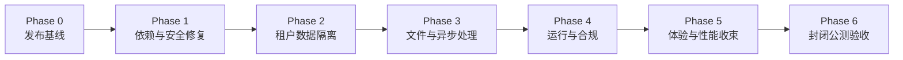

# Broker Desk 公测整改与优化执行计划

> 基线版本：`v0.2.0-rc.1`（2026-08-05）  
> 计划日期：2026-08-09  
> 计划依据：`PUBLIC_BETA_READINESS_AUDIT_2026_08_09` 的代码、测试、依赖和运行架构审计结论。  
> 目标：把当前“受控内部演示候选”推进到“可承载真实客户资料的封闭公测”。本计划不等同于正式商用上线。

## 2026-08-09 实施状态更新

本轮已完成可在代码库内完成的阻断项收束：生产模式 fail-closed、PostgreSQL 租户会话边界、归档生命周期、私有数据库附件路径、远程读取服务限制、异步导入作业的状态/幂等/重试骨架，以及相应迁移和静态门禁。

仍不能被标记为“已上线完成”的事项只包括需要真实托管基础设施才能证明的运行证据：受限运行时角色、托管调度器、远程读取供应商、私有文件容量与备份恢复、监控告警、staging/production 隔离和实际回滚演练。它们不是遗漏，而是因本轮明确不部署空白服务器而保留的外部验收条件；代码会在这些条件缺失时拒绝进入生产模式。

## 1. 发布判断与边界

### 当前状态

| 判断 | 状态 | 原因 |
| --- | --- | --- |
| 本机演示 / 合成数据验证 | 可继续 | 主流程、模板预览和权限骨架已存在。 |
| 受控内部测试 | 有条件可进行 | 仅限授权内部账号；不得把当前环境视为已具备生产级文件、数据隔离与恢复保障。 |
| 封闭公测（真实客户资料） | 不可开始 | 租户 RLS、依赖漏洞、生产文件存储、可复现发布、监控与恢复尚未闭环。 |
| 正式商用 | 不可开始 | 除上述问题外，隐私治理、可靠性、无障碍、支持与运营机制仍不完整。 |

### 本轮范围

1. 保护完整业务生命周期：登录、租户、案件、主体、物件、附件、提取、确认、模板、输出和审计。
2. 保持产品核心边界：`输入 -> 提取/确认 -> 案件工作台 -> 输出`。不在本轮引入 CRM、账单、通用 AI 聊天或模板商城商业化。
3. 在安全与数据链路稳定前冻结新功能；允许修复、性能、可用性和必要的产品收束。

### 明确不在本轮范围

- AI 自主决策或自动写入已确认业务事实。
- 企业 SSO/SCIM、计费订阅、模板交易、复杂审批流。
- 无明确真实用户验证的第二类输出文书扩张。

## 2. 版本与门禁

| 里程碑 | 发布条件 | 允许的环境用途 |
| --- | --- | --- |
| `v0.2.1-security-baseline` | Phase 0 与 Phase 1 完成 | 内部安全和迁移验证，不接收真实客户资料。 |
| `v0.3.0-closed-beta` | Phase 0 至 Phase 5 完成，且 Phase 6 公测准入清单通过 | 指定客户、有限席位、真实资料。 |
| `v1.0.0-production` | 封闭公测稳定运行、恢复演练与合规复核完成，并补齐正式运营能力 | 正式销售与生产运行。 |

任何里程碑不得以“页面可打开”替代下列证据：迁移记录、自动化测试结果、访问隔离测试、恢复演练记录、可追溯部署版本。

## 3. 执行顺序

- Phase 0-3 是真实资料封闭公测的阻断项，不能并入“以后再做”。
- Phase 4 可与 Phase 3 后半段并行，但不得晚于封闭公测开启。
- Phase 5 只在核心链路稳定后进行，避免反复翻新 UI 干扰安全和数据验证。

## 4. Phase 0：可复现发布基线（预计 1-2 个工作日）

### P0-01 工作区与版本收束（阻断）

**问题**：`main` 存在大量未提交改动、未跟踪迁移与重复页面文件，当前版本无法由干净克隆稳定复现。  
**行动**：

1. 将当前改动按功能拆分为最小、可审阅提交；禁止“一个大提交包含全部改动”。
2. 处理重复文件 `src/app/templates/page 2.tsx`：确认保留源、删除或归档副本，并在 CI 中检查无意外同名文件。
3. 所有 `db/migrations` 进入版本控制，按时间顺序命名，记录适用环境与回滚方式。
4. 更新 `env.example`，列出必需变量、是否敏感、是否可用于本机/预发布/生产；不得包含实际密钥。

**验收**：

- 从空目录执行 clone、install、migrate、build、start，可启动到登录页。
- `git status --short` 为空；版本标签与提交 SHA 对应。
- 迁移清单、运行时所需环境变量、发布说明三者一致。

**证据**：发布提交 SHA、迁移应用日志、干净环境构建日志、`RELEASE_V0.2.1_SECURITY_BASELINE.md`。

### P0-02 发布与回滚规则（阻断）

**行动**：定义 staging 与 production 的最小发布流程：构建产物、数据库迁移、健康检查、回滚边界、负责人和变更记录。

**验收**：可在 staging 完成一次“部署 -> 验证 -> 回滚 -> 再部署”的演练，且数据库迁移的不可逆操作有明确替代方案。

## 5. Phase 1：依赖与应用安全基线（预计 2-4 个工作日）

### P1-01 高危依赖处置（阻断）

**问题**：生产依赖审计存在 Next、`xlsx`、`pdfjs-dist` 等高危项。  
**行动**：

1. 升级 Next 至经完整回归验证的安全版本；记录升级带来的路由、代理与 Server Actions 行为变更。
2. 对 `xlsx` 制定替换或隔离方案：优先更换可维护解析器；无法立即替换时，将不可信 Excel 解析移入资源受限的隔离进程，并限制文件大小、工作表数量、单元格数量和执行时间。
3. 对 `pdfjs-dist`、`@pdfme/converter` 链路升级或限定仅处理可信模板；若无法解除高危依赖，封闭公测不得接收外部 PDF。
4. 把 `npm audit --omit=dev` 作为 CI 阻断；每个例外必须有风险接受人、到期日和替代控制。

**验收**：

- 生产依赖无 Critical/High；若技术上无修复，存在经批准的临时隔离措施、到期日和回归测试。
- 恶意或超限 Excel/PDF 不能占满请求线程、越权访问数据或造成服务不可用。

### P1-02 HTTP 与请求边界（阻断）

**行动**：配置 CSP、HSTS（仅 HTTPS 环境）、`X-Content-Type-Options`、`Referrer-Policy`、`Permissions-Policy`；对登录、上传、下载、生成和 AI/OCR 接口做分层速率限制与大小限制。

**验收**：安全响应头由自动化检查验证；速率限制返回可理解的 429 响应且不泄露内部信息。

### P1-03 错误处理与敏感信息脱敏（阻断）

**行动**：所有用户可达路由具备统一错误边界；错误页面给出恢复路径与请求编号，不显示 SQL、路径、租户 ID、环境变量、堆栈或原始 OCR 内容。日志中对姓名、证件号、电话、地址、附件 URL 脱敏。

**验收**：故意触发数据库、授权、上传、模板渲染异常时，前端无内部错误信息；服务端可用请求编号定位完整错误。

## 6. Phase 2：多租户数据隔离（预计 5-8 个工作日）

### P2-01 PostgreSQL RLS 与会话绑定（阻断）

**问题**：当前 `production-readiness` 已明确生产模式没有把 Clerk subject 绑定到数据库事务；仅靠应用层过滤不构成生产级租户边界。  
**行动**：

1. 为所有 tenant-scoped 表建立 RLS policy，并列出不受租户约束的官方模板、平台管理员数据与审计数据。
2. 建立 `withTenantTransaction()`：每次业务查询在单一事务中写入受控 session variable，再执行读写；禁止绕过该接口的直接业务 pool 查询。
3. 定义平台管理员跨租户访问为显式、审计化的操作，不复用普通成员权限。
4. 对对象存储、生成文件、缓存键、队列任务同样使用 tenant ID 作为强制边界。

**验收**：

- 用户 A 无论通过页面、API、直接猜测 ID、附件 URL、缓存命中或后台任务，均不能读取或修改用户 B 所属租户数据。
- 每个 tenant-scoped 表都有 RLS 覆盖测试；随机抽样表的 policy 与数据访问代码一致。
- 无有效 membership、冻结 membership、租户切换和平台管理员路径都有测试。

### P2-02 授权模型回归（阻断）

**行动**：修复过期的 `test:tenant-session` 测试，围绕当前导航和会话模型重新建立行为断言；保留并扩展 tenant-data-access、governance、production-security 测试。

**验收**：CI 对未登录、无成员、普通成员、租户管理员、模板管理员、平台管理员逐项验证允许与拒绝路径。

### P2-03 生命周期：归档、恢复与删除（P1）

**行动**：案件、主体、物件使用一致的状态机：`active -> archived -> deletion_requested -> deleted/retained`。删除必须列出关联文件、输出物与保留规则；归档/恢复/删除均记录审计日志。

**验收**：归档数据默认不参与普通检索和输出；恢复保留原关联；永久删除须满足保留策略并可审计。

## 7. Phase 3：附件、提取与异步作业（预计 5-8 个工作日）

### P3-01 私有对象存储与安全上传（阻断）

**问题**：生产文件存储未配置，身份资料生产上传返回 503；本地存储与 MIME 字符串检查不适合真实资料。  
**行动**：

1. 使用私有对象存储，不公开 bucket；下载使用短时、权限校验后的签名 URL 或受控流式下载。
2. 服务器端检测文件魔数与真实类型；限制数量、单文件/总量、页数、压缩比和图片像素。
3. 接入恶意文件扫描或在封闭公测前使用隔离扫描网关；扫描失败默认不可进入提取。
4. 记录文件 hash、来源、归属、上传者、扫描状态、保留期限和删除状态。

**验收**：

- 上传成功、扫描失败、类型伪造、文件超限、重复上传、断点失败都有确定状态和可恢复提示。
- 跨租户无法通过 URL、对象 key 或生成附件访问文件。

### P3-02 异步提取与幂等（阻断）

**行动**：把 OCR、Excel/PDF 解析、缩略图、PDF 生成从请求线程移至带队列的后台任务。任务拥有 idempotency key、重试策略、超时、死信/人工重试入口和状态记录。

**验收**：

- 同一文件重复提交不会产生重复候选、重复输出或重复收费。
- 刷新页面、网络中断和 worker 重启后可查询任务状态并继续或明确失败。
- 长文件不阻塞页面请求；用户可离开并稍后返回查看结果。

### P3-03 证据与确认模型（P1）

**行动**：提取候选必须关联来源文件、页码/区域、置信度和规则/模型版本；确认、修正、拒绝、不明必须可追溯。输出仅使用 confirmed/edited 的业务事实和明确保存的输出草稿。

**验收**：每个进入输出的字段能追溯来源或人工输入者；无法解释来源的值不得静默填入输出。

## 8. Phase 4：可运行性、恢复与合规（预计 5-8 个工作日）

### P4-01 预发布与生产环境（阻断）

**行动**：建立独立 staging，使用独立 Clerk、数据库、对象存储和密钥；生产密钥仅存在托管密钥系统。定义环境配置差异和变更流程。

**验收**：staging 不能读写生产数据；每次发布先在 staging 完整回归后才允许进入 production。

### P4-02 监控、审计与告警（阻断）

**行动**：接入错误追踪与结构化日志，统一 request ID；记录关键安全与业务事件：登录、租户成员变更、权限变更、文件上传/下载、候选确认、模板安装/发布、输出生成/下载、归档/删除。

**验收**：能在 10 分钟内定位一次模拟的跨租户拒绝、上传失败、输出生成失败；日志不含未脱敏 PII。

### P4-03 备份、恢复与回滚演练（阻断）

**行动**：定义数据库 PITR/备份周期、对象存储版本与删除保护、恢复负责人、RTO/RPO；完成至少一次独立环境恢复演练。

**验收**：从备份恢复指定租户、附件引用和输出审计记录的过程有时间记录和结果证据；发布回滚不造成未知数据损坏。

### P4-04 日本个人信息治理（阻断）

**行动**：完成隐私政策、利用目的、保留/删除、导出、更正、委托处理方、跨境传输、AI/OCR 使用说明、事故响应与联系人机制。对在留卡/驾照等高敏感文件设定最小权限、默认保留期和下载审计。

**验收**：客户可见文档与实际数据流、对象存储、日志、模型/识别服务一致；删除与导出请求可执行并留审计。

## 9. Phase 5：核心体验、性能与产品收束（预计 5-8 个工作日）

### P5-01 核心端到端路径（P1）

必须自动化并在 staging 回归：

1. 登录 -> 选择工作区 -> 新建案件 -> 手动录入 -> 保存 -> 归档/恢复。
2. 上传文件 -> 异步提取 -> 查看证据 -> 接受/修正/保留 -> 确认数据。
3. 选择案件 -> 选择已安装模板 -> 预览 -> 生成 -> 下载 -> 审计记录。
4. 模板库 -> 安装官方版本 -> 租户本地副本 -> 修改/升级提示 -> 跨设备加载一致。

**验收**：关键路径在桌面与移动窄屏均无死路、随机跳转或内部语言泄漏；失败状态可恢复。

### P5-02 性能预算与加载体验（P1）

**行动**：量测导航、首屏、重页面、模板预览和上传后状态；消除整页空白、错误 skeleton、阻塞式数据库/Clerk 调用和不必要的全量查询。采用页面级 loading、预取、缓存与分页，但不得缓存跨租户数据。

**验收目标**：

- 点击后 100ms 内出现明确视觉反馈。
- 常用热路由 p95 感知可用时间 <= 500ms；冷路由 <= 1.5s，并显示不位移的加载占位。
- 不出现页面先渲染旧底图再替换、模块点击后超过 1s 无反馈、或布局累计位移明显的情况。

### P5-03 产品范围收束（P1）

**行动**：对遗留路由和模块逐项分类为 `保留`、`隐藏待验证`、`内部管理` 或 `删除`。优先保留案件工作台、输入、整理、输出、模板库与最小后台；不让旧 CRM/报价/合同/服务请求入口以半成品状态干扰用户。

**验收**：导航只呈现当前角色可完成的任务；每个入口有明确用户、目标、下一个动作和空状态。

### P5-04 无障碍、术语与界面一致性（P1）

**行动**：关键流程达到 WCAG 2.2 AA 的可键盘操作、焦点可见、语义标签、错误提示、对比度和移动端可用性；术语从受控词表输出，禁止把 schema、mapping、内部状态、AI 推理话术暴露给经纪人。

**验收**：日本语关键页面通过术语扫描；键盘完成登录、选择、上传、确认、输出；错误信息可理解且具备恢复操作。

### P5-05 模板发布与跨设备一致性（P1）

**行动**：官方模板采用不可变版本；租户安装获得独立副本；本地调整保存为租户级校准版本，官方更新只提供显式升级/比较/回滚，不覆盖租户修改。模板布局与版本号进入输出审计快照。

**验收**：同一租户在两台设备生成同一模板时布局一致；不同租户的本地修改互不影响；已生成 PDF 可追溯当时使用的模板版本与布局版本。

## 10. Phase 6：封闭公测验收（预计 3-5 个工作日）

### 公测准入清单

- [ ] Phase 0-4 的所有阻断项关闭并有证据链接。
- [ ] 生产依赖无未处理 Critical/High，或例外已批准且隔离到位。
- [ ] RLS、附件访问、租户切换、管理员越权路径自动化通过。
- [ ] staging 完成四条核心 E2E 路径和异常恢复测试。
- [ ] 备份恢复和一次发布回滚演练完成。
- [ ] 隐私与数据处理文档发布并与实际供应商/数据流一致。
- [ ] 关键页面性能与无障碍目标达标。
- [ ] 模板跨设备一致性回归通过。
- [ ] 公测支持机制确定：受邀名单、问题上报、严重级别、响应时限、停用开关。

### 封闭公测规则

1. 初始限制为少量命名租户、有限席位和明确业务场景。
2. 只开放已通过验收的输入类型与输出模板；未验证功能必须在 UI 中隐藏，而不是标注“实验中”后继续暴露。
3. 每周复盘错误、数据冲突、模板偏移、权限拒绝、处理时长和用户放弃点；高危安全与数据完整性事件触发暂停扩容。

## 11. 工作包看板

| ID | 优先级 | 工作包 | 依赖 | 预计 | 当前状态 |
| --- | --- | --- | --- | --- | --- |
| P0-01 | P0 | 可复现发布基线 | 无 | 1d | 代码与文档已收束，待干净克隆证据 |
| P0-02 | P0 | 发布回滚规则 | P0-01 | 1d | 未开始 |
| P1-01 | P0 | 高危依赖处置 | P0-01 | 2-4d | 未开始 |
| P1-02 | P0 | 请求边界与安全头 | P0-01 | 1-2d | 未开始 |
| P1-03 | P0 | 错误边界与脱敏 | P0-01 | 1-2d | 未开始 |
| P2-01 | P0 | RLS 与事务会话绑定 | P0-01 | 5-8d | 代码、迁移与静态验证完成，待托管运行角色负向证据 |
| P2-02 | P0 | 授权测试回归 | P2-01 | 1-2d | 未开始 |
| P2-03 | P1 | 生命周期 | P2-01 | 2-3d | 部分实现，待验收 |
| P3-01 | P0 | 私有对象存储与上传安全 | P2-01 | 3-5d | 未开始 |
| P3-02 | P0 | 异步任务与幂等 | P3-01 | 3-5d | 代码、迁移与重试入口完成，待托管 worker 演练 |
| P3-03 | P1 | 证据与确认模型 | P3-02 | 2-3d | 部分实现，待验收 |
| P4-01 | P0 | staging/production 分离 | P0-02 | 2-3d | 未开始 |
| P4-02 | P0 | 监控、审计与告警 | P4-01 | 2-3d | 未开始 |
| P4-03 | P0 | 备份恢复演练 | P3-01, P4-01 | 1-2d | 未开始 |
| P4-04 | P0 | 隐私与数据治理 | P3-01, P4-01 | 2-4d | 未开始 |
| P5-01 | P1 | 核心 E2E | P2-02, P3-02 | 2-4d | 未开始 |
| P5-02 | P1 | 性能与加载 | P4-01 | 2-4d | 部分实现，待量测 |
| P5-03 | P1 | 模块收束 | P5-01 | 1-3d | 未开始 |
| P5-04 | P1 | 无障碍与术语 | P5-01 | 2-4d | 部分实现，待验收 |
| P5-05 | P1 | 模板跨设备一致性 | P2-01, P5-01 | 2-4d | 部分实现，待验收 |
| P6 | P0 | 封闭公测验收 | 全部 | 3-5d | 未开始 |

## 12. 风险与决策记录

| 风险 | 决策 |
| --- | --- |
| 为赶进度绕过 RLS | 不接受。真实资料不进入未完成 RLS 的环境。 |
| 高危解析依赖短期无替代 | 不接受“仅提示用户注意”。必须替换、隔离或缩小输入范围。 |
| 依赖本机/ngrok 作为公测基础设施 | 不接受。仅可作开发演示；封闭公测需托管 staging/production 与独立存储。 |
| 模板更新覆盖租户校准 | 不接受。官方版本不可变，租户副本独立，升级显式处理。 |
| 把 AI 候选直接写入案件或输出 | 不接受。候选必须经确认并保留证据。 |
| 以页面视觉完成代替可靠性验收 | 不接受。任何 P0 必须同时具备代码、自动化测试、运行验证和文档证据。 |

## 13. 立即开始的第一批任务

1. **P0-01**：清理发布基线，确认迁移、重复文件、环境变量与干净构建流程。
2. **P1-01**：处理 Next/XLSX/PDF 依赖风险，输出受影响输入范围与替代方案。
3. **P2-01 设计冻结**：列出全部 tenant-scoped 表、RLS policy、平台管理员例外和 `withTenantTransaction()` 接口，再开始迁移实施。
4. **P3-01 技术选型**：确定对象存储、扫描、任务队列与成本上限；任何产生持续费用的服务须在启用前明确说明。

完成以上四项设计/基线工作后，才进入实际的 RLS、文件链路和 staging 代码改造。
