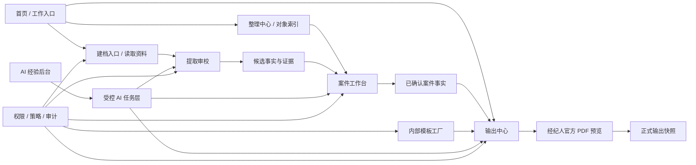
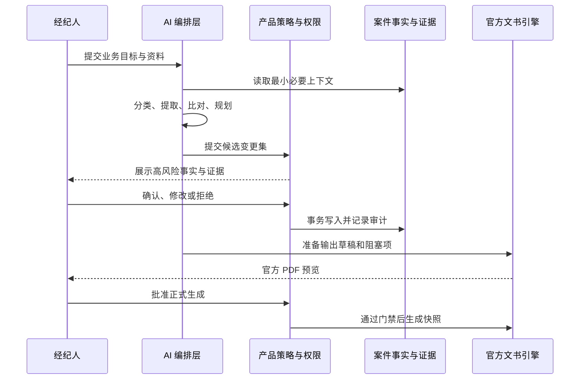

# Broker Desk 产品与技术设计总章

日期：2026-07-15  
状态：当前产品与技术方向的最高级设计约束  
适用范围：下一阶段产品设计、工程重构、AI 能力建设、试点验收和迭代优先级

## 1. 总结性判断

Broker Desk 当前已经完成了一个可工作的纵向闭环：

```text
建立案件 -> 读取资料 -> 确认案件事实 -> 选择保证公司 -> 生成官方 PDF
```

这证明了用户需求、核心价值和关键技术路径成立。但当前版本仍是“试点前纵向原型”，还不是可以稳定交付给多家事务所的成品。

现阶段的主要问题不是缺少功能，而是三个系统仍然混在一起：

1. 经纪人每天使用的案件工作台。
2. 内部人员维护 PDF 模板、字段映射和 AI 经验的生产工具。
3. 早期通用 CRM 留下的客户阶段、跟进、报价、任务等模型。

下一阶段必须先完成边界收敛，再扩展输入格式、模板数量或智能能力。否则产品会不断增加页面和字段，却不会变得更容易使用。

## 2. 产品定位

### 2.1 一句话定位

面向用户的定位：Broker Desk 是面向日本小型房地产中介团队的案件事实工作台，把分散在 Excel、PDF、证件和图片里的信息整理成可信、可复用的案件事实，并安全地写入官方业务文书。

面向内部产品与技术的定位：Broker Desk 是一个 AI 原生、证据驱动的房地产案件操作系统。它把模型当作案件工作流中的一等操作员，但把事实、权限、状态、模板、审计和最终责任保留在产品自身。

### 2.2 核心承诺

```text
资料を入れる
  -> 足りない・怪しい項目だけ確認する
    -> 公式書類を出す
```

用户购买的不是 OCR、AI 或 PDF 编辑器，而是以下结果：

- 少重复输入。
- 少在多个文件之间查找。
- 随时知道还差什么、已经完成多少。
- 不破坏官方文书格式。
- 同一事实确认一次，可在后续文书中复用。

### 2.3 产品不是什么

V1 不应成为：

- Salesforce 式通用 CRM。
- 物业管理系统或房源门户。
- 任意文件都能自动理解的通用 OCR 平台。
- 面向普通经纪人的 PDF 模板设计器。
- 用聊天框代替业务界面的 AI 助手。
- 能自行确认事实、做合规判断或代替经纪人提交申请的自治代理。

## 3. 目标用户与首个市场切口

### 3.1 主要用户

- 日本小型房地产中介公司中的经纪人、资料录入人员和复核人员。
- 当前依赖 Excel、下载的保证公司 PDF、Preview/WPS 和重复复制粘贴。
- 不需要大型 CRM 的销售自动化，但非常需要可靠的资料整理和官方文书生产。

### 3.2 首个市场切口

首个切口继续聚焦租赁业务中的保证公司申请书，因为它同时具备：

- 高频。
- 重复字段多。
- 官方格式严格。
- 人工抄写成本明确。
- 成功与失败容易验收。

当前虽然已有五家保证公司模板，但试点不应以“模板数量”作为成功标准。应先选择 1 至 2 个真实高频模板，把完整链路做到稳定、快速、可信，再扩大覆盖。

## 4. 北极星工作流

### 4.1 普通经纪人的主流程

```text
开始工作
  |
  +-- 新建案件 --------+
  |                    |
  +-- 读取资料 --------+--> 确认资料归属
                              |
                              v
                        系统生成候选事实
                              |
                              v
                    只处理缺失 / 不确定 / 冲突
                              |
                              v
                        形成已确认案件事实
                              |
                              v
                       选择输出类型与模板
                              |
                              v
                     补充该模板专属的少量信息
                              |
                              v
                      预览官方文书并生成 PDF
```

### 4.2 体验原则

1. 首页只回答“现在从哪里开始”和“哪些事情卡住了”。
2. 读取资料只负责上传、识别、归属和候选值确认。
3. 整理中心只负责找到正确对象和进入工作台，不承担大规模编辑。
4. 案件工作台是主要工作面，必须持续显示完成度、下一项和来源依据。
5. 输出中心只处理输出选择、输出缺失项、官方表单预览和历史输出。
6. 技术字段名、模型置信度术语、PDF 坐标和模板映射不得进入经纪人主流程。
7. 所有跳转都必须落到具体对象、具体问题或具体输出任务，不能只跳到模块首页。

## 5. 核心对象模型

### 5.1 业务对象

| 对象 | 定义 | 是否可复用 | 主要负责人 |
| --- | --- | --- | --- |
| `Tenant` | 一家使用 Broker Desk 的公司或个人账户 | 是 | 平台/租户管理员 |
| `UserMembership` | 用户在租户中的身份、角色和权限 | 是 | 租户管理员 |
| `Case` | 一次具体房地产业务的工作容器 | 否 | 经纪人 |
| `Party` | 人或公司，例如申请人、业主、保证人、管理公司 | 是 | 经纪人/资料人员 |
| `Property` | 建筑、房间、地址、租金等可复用物件信息 | 是 | 经纪人/资料人员 |
| `SourceMaterial` | 原始 Excel、PDF、证件、图片或手工资料 | 是，且应不可变 | 系统/资料人员 |
| `ExtractionCandidate` | 从资料中提出但尚未确认的候选事实 | 否 | 系统提出，用户复核 |
| `ConfirmedFact` | 用户确认、可供业务复用的事实 | 是 | 用户确认 |
| `OutputDraft` | 某个输出模板特有的临时或专属字段 | 否 | 经纪人 |
| `GeneratedOutput` | 某次生成时的数据、模板和文件快照 | 否且不可变 | 系统 |
| `CorrectionEvent` | 候选值与最终确认值之间的可审计差异 | 是 | 系统记录 |
| `ExperienceRule` | 经审核后可复用的提取、映射或解释经验 | 是且有作用域 | 内部审核人员 |
| `TemplateVersion` | 官方 PDF、字段绑定、坐标和验证状态 | 是且版本化 | 内部模板作者 |

### 5.2 关系规则

```text
Tenant
  -> Memberships
  -> Cases
       -> Parties
       -> Properties
       -> SourceMaterials
            -> ExtractionCandidates
       -> ConfirmedFacts
       -> OutputDrafts
            -> GeneratedOutputs
       -> CorrectionEvents

Platform Template Registry
  -> TemplateVersion
       -> Tenant Variant (future, optional)
            -> Case One-off Adjustment
```

关键规则：

- `Case` 是一次工作的容器，但 `Party` 和 `Property` 不应被复制成每案一份。
- `SourceMaterial` 是证据，不是事实本身。
- `ExtractionCandidate` 不是可输出事实。
- `ConfirmedFact` 必须保留来源、确认人、确认时间和状态历史。
- `OutputDraft` 不得反向污染通用案件事实。
- `GeneratedOutput` 必须保存生成时快照，后续修改案件不得改写历史文件。
- `TemplateVersion` 是生产资产，普通经纪人无权修改全局版本。

## 6. 数据真相链

### 6.1 状态流转

```text
原始资料
  -> 原文 / 单元格 / 图像证据
    -> 候选值
      -> 已确认 / 已修改 / 不采用 / 不适用 / 不明 / 冲突待解
        -> 案件事实
          -> 输出草稿值
            -> 生成文件快照
```

### 6.2 信任状态

每个字段至少需要以下信息：

- `value`：当前值。
- `status`：候选、已确认、已修改、缺失、冲突、不适用、不明。
- `sourceRef`：资料、页码、单元格或图像区域。
- `extractor`：规则、OCR 或模型版本。
- `confidence`：只作为审校排序信号，不作为事实真实性证明。
- `confirmedBy` / `confirmedAt`：谁在何时确认。
- `history`：旧值、修改原因和相关修正事件。

### 6.3 不可违反的写入规则

- 模型不能直接写入 `ConfirmedFact`。
- 低风险分类可以自动路由，但不能自动确认姓名、地址、金额、日期、身份关系等业务事实。
- 已确认值不得被新资料或模型建议静默覆盖。
- 同一字段的多来源不一致必须形成冲突，而不是选择“看起来最像”的值。
- 姓名、公司名、地址、建筑名、文件名和官方表单文字应保留原文，不做硬翻译。

## 7. 模块职责与页面边界

### 7.1 首页：工作入口

首页只保留：

- 四个主入口：新建案件、读取资料、补齐信息、输出文件。
- 最多 3 至 5 个真正需要当前用户处理的卡点。
- 可选的最近案件或继续上次工作。

首页不再承载：

- 完整对象索引。
- 资料关系全景图。
- 全量最近更新。
- 复杂统计和多层筛选。

### 7.2 建档入口 / 读取资料：收件与归属

职责：

- 创建或选择案件、主体、物件。
- 上传 Excel、PDF、证件和图片。
- 判断资料类型。
- 确认资料归属。
- 展示读取是否成功和需要人工补充的值。

普通用户审校界面只显示：

- 资料中读到的值。
- 对应的业务名称。
- 来源片段或位置。
- 接受、修改、不存在、暂不处理。

不得显示：

- 数据库字段名。
- “模型建议”“系统技能”等内部宣传。
- 字段映射表。
- C/W/I 等内部问题统计。
- 模型或规则实现细节。

### 7.3 整理中心：对象索引

职责：

- 查找案件、主体、物件和待归属资料。
- 通过类型、状态、负责人和业务特征筛选。
- 提供保存视图，例如“我的待补案件”“本周新资料”“待输出案件”。
- 进入具体对象的工作页面。

设计要求：

- 默认不把不同对象强行塞进同一套列结构。
- “全部”只用于搜索结果，不是主工作视图。
- 案件、主体、物件应有各自有意义的摘要列。
- 列表行本身可点击，避免重复的“查看物件/查看案件”操作列。
- 右侧详情只显示能帮助用户决定下一步的信息。

### 7.4 案件工作台：产品中心

左栏固定回答：

- 当前适用字段完成度。
- 还差多少必填项。
- 哪个分组卡住。
- 当前已确认的重要事实。
- 下一项应该处理什么。

右栏负责：

- 缺失、候选和冲突项的连续处理。
- 输入后自动保存或明确确认。
- 保存成功后，左侧进度和内容即时增长。
- 条件字段只在适用时出现。
- 可随时查看来源证据和修改历史。

完成度分为两种，不得混用：

1. `案件资料完成度`：当前案件条件下适用的必填事实是否齐全。
2. `输出准备度`：针对一个具体模板，通用事实与模板专属字段是否可生成。

### 7.5 输出中心：文书任务

职责：

- 选择案件。
- 选择保证公司与模板版本。
- 显示只与当前输出有关的缺失项。
- 跳回具体字段完成修复。
- 预览官方 PDF。
- 生成、下载并保存输出历史。

输出流程应是一次有状态的 `OutputJob`，而不是一组散落的页面跳转。

### 7.6 经纪人预览：最终确认

普通经纪人可以：

- 查看原版官方 PDF 上的最终值。
- 确认候选值。
- 填写模板专属字段。
- 对当前案件做一次性位置或字号修正。
- 在门禁通过后下载。

普通经纪人不能：

- 绑定字段键。
- 新建模板字段。
- 修改全局坐标。
- 保存或发布官方模板。
- 运行模板预匹配或查看技术置信度。

### 7.7 内部模板工厂：后台生产工具

模板工厂必须是独立的、角色受限的后台模块，负责：

- 上传和锁定官方 PDF。
- 建立字段绑定和坐标。
- 设置 `certified_auto`、`assisted_candidate`、`manual_electronic`。
- 运行样本集和视觉回归。
- 版本化、审核、发布、回滚和废弃模板。

模板发布需要双人复核或至少独立审核，不能由普通经纪人的一次预览操作改变。

### 7.8 AI 经验后台

职责：

- 汇总修正事件。
- 聚类重复错误。
- 生成带作用域的经验草稿。
- 人工审核后启用。
- 监控启用后的回归效果。

它不应成为经纪人的额外操作页面。

### 7.9 模块总图



图中的核心边界是：模板工厂和 AI 经验后台服务于主流程，但不属于普通经纪人的主导航。

## 8. AI 能力定位

### 8.1 总体原则

Broker Desk 不需要一个可以自由行动的通用 Agent。需要的是一组受限、可评估、可审计的智能任务，由产品工作流在正确时机调用。

```text
确定性程序优先
  -> 模型提出结构化候选
    -> 规则和权限校验
      -> 用户确认高风险事实
        -> 写入审计事件
```

模型不是数据库，不是权限系统，不是业务状态机，也不是官方 PDF 渲染引擎。

### 8.2 模型可以做什么

| 能力 | 输出形式 | 自动写入范围 |
| --- | --- | --- |
| 文档类型和模板家族分类 | 类型、候选归属、理由 | 只允许低风险路由 |
| 证件、扫描件和未知格式提取 | 结构化候选值 + 证据位置 | 不直接确认事实 |
| 文本规范化 | 日期、电话、金额、假名候选 | 需通过确定性校验 |
| 跨来源冲突解释 | 冲突摘要和证据对比 | 不选择最终值 |
| 工作台处理建议 | 下一项、相关字段、简短说明 | 不修改事实 |
| 输出前检查 | 风险、缺失、版面问题说明 | 不能绕过下载门禁 |
| 模板预匹配 | 字段绑定和位置候选 | 仅模板作者可保存 |
| 修正经验草拟 | 带作用域的经验草稿 | 需内部审核后启用 |
| 回归故障诊断 | 原因假设和检查建议 | 仅 PM/QA 使用 |

### 8.3 模型不能做什么

- 自行确认姓名、地址、金额、日期、身份关系或合同事实。
- 用猜测补齐原资料中不存在的值。
- 静默覆盖已确认事实。
- 决定租赁审查、反洗钱、法律或合规结论。
- 修改、发布或替换官方模板。
- 绕过权限、输出门禁或审计日志。
- 自动向外部保证公司提交申请。
- 把一次用户修正直接提升为全局规则。
- 硬翻译姓名、地址、公司名、建筑名和官方文书标签。

### 8.4 推荐模型路由

当前模型层建议按任务风险，而不是按页面固定模型：

| 层级 | 推荐用途 | 约束 |
| --- | --- | --- |
| `gpt-5.6-luna` | 文档类型初筛、模板家族预筛、低成本批量路由 | 不输出可直接确认的业务事实 |
| `gpt-5.6-terra` | 标准资料提取辅助、冲突摘要、工作台提示、常规输出预检 | 默认在线智能层，结构化输出并保留证据 |
| `gpt-5.6-sol` | 未知模板理解、复杂证件/扫描件、难冲突解释、经验草拟、复杂版面风险 | 只在高价值或高难度任务调用 |
| 不使用模型 | 已知 Excel 模板、字段完整度、日期/金额/电话校验、权限、状态机、PDF 渲染、下载门禁 | 必须保持确定性和可回归 |

这一路由是 Broker Desk 的产品建议，不是模型厂商给出的业务结论。依据是 OpenAI 对 [GPT-5.6 Sol](https://developers.openai.com/api/docs/models/gpt-5.6-sol)、[GPT-5.6 Terra](https://developers.openai.com/api/docs/models/gpt-5.6-terra) 和 [GPT-5.6 Luna](https://developers.openai.com/api/docs/models/gpt-5.6-luna) 的官方定位，再结合本产品任务风险进行的分层。

切换模型前必须建立相同样本、相同结构化输出和相同验收指标的离线评测。不能因为新模型更强就直接替换生产路由。

### 8.5 智能任务的统一接口

每个智能任务至少应记录：

- `taskType` 和业务目标。
- 输入资料引用和允许读取的字段范围。
- 使用的模型、提示版本和工具版本。
- 结构化输出 schema 版本。
- 候选值、来源证据和不确定性。
- 自动校验结果。
- 用户接受、修改、拒绝或跳过。
- 延迟、成本和错误类型。

## 9. AI 原生极限形态

### 9.1 AI 原生的定义

AI 原生不等于页面里增加聊天框，也不等于把固定流程换成一个自由行动的 Agent。

Broker Desk 的 AI 原生形态应满足四个条件：

1. 产品核心能力可以通过有类型、受权限保护的工具接口直接被模型调用，而不要求模型模拟鼠标操作页面。
2. 模型接收到的是案件对象、事实状态、来源证据和业务目标，而不是整页 HTML 或未经筛选的数据库内容。
3. 模型产生的是可验证的计划、候选值和变更集；产品负责校验、授权、确认、事务写入和审计。
4. 更强模型可以在不重写业务系统的情况下替换旧模型，并通过同一套评测证明生产力确实提高。

因此，AI 原生的技术基础不是 Prompt，而是：

```text
稳定的领域对象
  + 可调用的业务工具
  + 证据与事实状态
  + 权限和策略引擎
  + 可回滚的变更集
  + 真实修正形成的评测与经验
```

### 9.2 产品的极限工作形态

在模型能力足够强、且产品积累了可靠经验后，用户可以用目标而不是步骤发起工作：

```text
“把今天收到的这组资料整理到池袋案件，
找出矛盾和缺失项，准备日本セーフティー申请书，
不要覆盖我已经确认的内容。”
```

系统执行：

1. 识别资料类型、所属案件和参与者。
2. 读取文本、表格和图像并形成候选事实。
3. 与案件现有事实和历史来源比对。
4. 自动完成无争议、可逆、低风险的整理动作。
5. 把需要用户判断的问题压缩成一个短队列。
6. 根据用户确认更新案件事实。
7. 建立输出任务，选择正确模板版本。
8. 补入确定可用的字段，运行完整度与版面检查。
9. 给用户一份可理解的最终变更摘要和官方 PDF 预览。
10. 在用户批准后生成正式文件并保存快照。

用户仍然拥有三次关键控制权：

- 确认有争议或高风险的案件事实。
- 确认正式文书上的候选与专属字段。
- 批准最终生成或未来对外提交。



### 9.3 模型可直接使用的产品内核

先建立内部应用服务，再根据成熟度暴露为 Agent tools 或 MCP 兼容接口。建议工具契约包括：

| 工具 | 作用 | 模型是否可直接执行 |
| --- | --- | --- |
| `search_work_objects` | 查找案件、主体、物件和待归属资料 | 是，只读 |
| `get_case_context` | 获取最小必要案件上下文、状态和权限 | 是，只读 |
| `attach_source_material` | 把资料挂到已确认的所有者 | 低风险时可执行，可撤销 |
| `extract_candidates` | 从资料生成带证据的候选值 | 是，不能确认 |
| `compare_case_sources` | 检测重复、冲突和缺失 | 是，只读 |
| `propose_fact_patch` | 生成一组事实变更建议 | 是，只生成提案 |
| `apply_approved_fact_patch` | 写入用户已批准的变更集 | 由产品校验后执行 |
| `create_output_job` | 建立输出任务 | 是，可撤销 |
| `prepare_output_draft` | 填充安全字段并列出阻塞项 | 是，不生成正式文件 |
| `render_output_preview` | 生成官方文书预览 | 是 |
| `generate_final_output` | 生成正式文件和快照 | 需要明确权限和批准 |
| `draft_experience_rule` | 从修正事件形成经验草稿 | 是，仅后台草稿 |

所有写工具必须返回：

- 预期变更。
- 受影响对象。
- 证据和理由。
- 可逆性。
- 所需权限。
- 需要人工批准的项目。
- 执行后的审计事件编号。

### 9.4 AI 参与会产生质变的功能

#### 资料入口

非 AI 产品只能支持固定模板和固定字段；AI 原生产品可以理解未知版式、多份资料之间的关系和模糊归属，并把它们转为同一案件事实模型。

#### 审校与整理

非 AI 产品要求用户逐字段检查；AI 原生产品可以根据风险、来源冲突、字段重要性和用户历史修正，把 149 个字段压缩为真正需要判断的 5 至 15 个问题。

#### 案件工作台

非 AI 产品展示静态表单；AI 原生产品可以动态决定当前适用字段、解释为什么需要、推荐下一项、自动关联已有主体与物件，并用自然语言回答“这个值从哪里来”“为什么还不能输出”。

#### 官方文书输出

非 AI 产品依赖人工模板映射；AI 原生产品可以为新模板生成初始字段绑定、识别长文本和分格风险、比较渲染前后图像，并把内部模板作者的校准工作缩短到审核与微调。

#### 日常运营

非 AI 产品依赖用户主动找任务；AI 原生产品可以识别卡住的案件、资料冲突、即将过期的信息和重复劳动，为团队生成有依据的工作队列。

#### 产品学习

非 AI 产品只保存最终值；AI 原生产品会把候选、修改、拒绝、原因、来源和模板结果组成修正事件，再由模型聚类和草拟可复用经验。

### 9.5 自动化等级

Broker Desk 应通过评测逐级提升，不直接追求全自动：

| 等级 | 含义 | 当前目标 |
| --- | --- | --- |
| L0 | 只展示固定表单和规则结果 | 已具备 |
| L1 | 模型提出候选、解释和优先队列 | 当前应完成 |
| L2 | 模型编排多个工具，生成完整可批准变更集 | 试点后重点 |
| L3 | 在可信模板、低风险字段和明确策略内自动执行可逆动作 | 有评测后逐项开放 |
| L4 | 以业务目标驱动整案准备，只把关键判断交给用户 | 中长期极限形态 |
| L5 | 模型自行确认事实、做合规结论并对外提交 | 不作为产品目标 |

自动化等级必须按“任务和字段”授予，而不是给整个 Agent 一个统一的自动权限。

### 9.6 随模型进化获得复利的设计

为了让模型升级直接带来生产力提升，以下部分必须与具体模型解耦：

- 领域对象和字段目录。
- 结构化输出 schema。
- 业务工具和权限契约。
- 来源证据格式。
- 事实状态机。
- 输出门禁和 PDF 渲染。
- 修正事件和评测样本。

每次模型升级只替换任务适配器，并运行固定评测：

```text
旧模型结果
  vs 新模型结果
    -> 准确率 / 人工确认数 / 延迟 / 成本 / 风险事件
      -> 达标后按任务灰度切换
```

更强模型的收益应体现为：

- 支持更多未知资料，而不是增加更多硬编码模板。
- 减少用户需要看的问题，而不是生成更多解释文字。
- 提高一次输出成功率，而不是让 Agent 做更多不可见动作。
- 降低内部模板生产成本，而不是放宽模板发布门槛。

### 9.7 抵御 AI 生产力冲击的真实壁垒

单纯的 OCR、表单 UI、Prompt 和模型 API 调用都不是长期壁垒。通用办公模型在短时间内就可能覆盖这些能力。

Broker Desk 可积累的防御资产是：

1. **案件事实图谱**：日本房产业务对象、关系、条件字段和信任状态。
2. **官方模板资产**：真实 PDF、版本、坐标、可自动字段和视觉回归基线。
3. **修正数据**：模型候选与经纪人最终决定之间的结构化差异。
4. **业务评测集**：按资料类型、字段、模板和异常场景衡量模型是否真的可用。
5. **工作流与门禁**：从证据到正式输出的权限、状态、审计和失败恢复。
6. **团队使用习惯**：可复用主体、物件、案件历史和租户私有经验。
7. **可信交付记录**：官方文书成功率、错误率、追溯能力和数据治理。

时间上不能承诺一个静态的“安全年限”。专业判断是：

- 如果停留在“上传文件 + OCR + 填表”，在通用模型快速进化下，差异化可能只有 6 至 12 个月。
- 如果完成上述产品内核，通用模型越强，Broker Desk 的候选整理和任务编排越便宜、越准确，而事实图谱、模板资产、评测和客户数据不会被通用模型自动复制。
- 真正的防御不是阻止 AI 替代产品，而是让每一代模型首先增强 Broker Desk，再通过领域数据和执行可靠性把增益留在产品内。

### 9.8 AI 原生体验边界

前台可以逐步增加一个全局意图入口，但不能用聊天取代可扫描的业务界面。

适合自然语言的任务：

- “把这三份资料放到同一个案件。”
- “只给我看阻止日本セーフティー输出的问题。”
- “比较这两个地址为什么不一致。”
- “用已经确认的信息准备申请书。”

适合结构化界面的任务：

- 核对姓名、地址、金额和身份关系。
- 批量查看完成度和来源。
- 选择条件、角色和不适用状态。
- 预览官方 PDF 和处理版面问题。
- 批准最终文件和高风险变更。

原则是：自然语言负责表达目标和压缩步骤，结构化界面负责建立信任、比较证据和承担责任。

## 10. 技术目标架构

### 10.1 目标分层

```text
Next.js UI
  -> Application Use Cases
       CreateCase
       IngestMaterial
       ReviewExtraction
       ConfirmFact
       PrepareOutput
       GenerateOfficialDocument
  -> Domain Services
       CaseDossier
       EvidenceAndTrust
       OutputPolicy
       TemplateGovernance
       CorrectionLearning
  -> Repositories
       Postgres
       Object Storage
       Audit/Event Store
  -> External Adapters
       OpenAI Responses API
       OCR
       PDF Renderer
       Identity Provider
```

页面不能继续直接依赖一个扁平、庞大的 `data.ts` 函数集合。应用用例层应成为权限、事务、审计和业务状态变更的统一入口。

### 10.2 当前结构需要收敛的部分

1. `data.memory.ts` 与 `data.postgres.ts` 已分别超过数千行，并维护大量重复实现。应按领域拆成 repository 接口，内存实现只保留给测试和演示。
2. 早期 `Client / Quotation / FollowUp / Task` 模型与当前 `Case / Party / Property / Output` 模型并存。试点链路必须只使用后者；旧 CRM 能力冻结，确认无依赖后再迁移或归档。
3. `BrokerageCase.confirmedDataJson` 目前承担过多责任。应逐步迁移为有类型、有来源、有状态历史的事实记录，同时保留兼容读层。
4. 当前 `BrokerageCaseType` 与界面业务类型不一致，必须建立真实案件类型和条件字段策略。
5. 当前资料归属类型和业务对象命名不统一，应收敛为 `case / party / property / unassigned`。
6. PDF 模板工厂必须从经纪人预览路由中拆出，并使用现有角色权限进行保护。

### 10.3 推荐基础设施

试点环境的最小可靠组合：

- Postgres：业务对象、事实、状态、审计、任务和模板元数据。
- 对象存储：原始资料、来源片段、官方模板、预览和生成文件。
- 后台任务队列：OCR、模型提取、PDF 生成和批量回归。
- 身份与租户隔离：Clerk + 服务端租户授权 + Postgres RLS 双重保护。
- OpenAI Responses API：只通过受控任务适配器调用。
- 可观测性：任务耗时、模型调用、失败原因、输出门禁、审计事件和 PII 访问日志。

内存数据驱动只用于自动化测试和明确标识的演示，不用于真实试点数据。

### 10.4 状态机而不是页面状态

至少建立以下后端状态机：

```text
SourceMaterial:
uploaded -> processing -> needs_assignment -> needs_review -> reviewed -> archived

Case:
draft -> collecting -> ready_for_output -> output_in_progress -> completed -> archived

OutputJob:
draft -> blocked -> ready_for_preview -> confirmed -> generated -> downloaded -> superseded

TemplateVersion:
draft -> qa_ready -> approved -> active -> deprecated -> rolled_back
```

页面只展示和推动这些状态，不能用 URL、按钮文案或本地组件状态代替业务状态。

## 11. 安全、隐私与审计

真实试点前必须完成：

- 所有业务读取和写入都经过租户与角色授权。
- 原始证件和敏感字段使用最小权限访问。
- 文件使用受控对象存储和短时签名链接，不进入公开静态目录。
- 模型调用只发送完成任务所需的最小资料片段。
- 日志不得记录完整证件号、地址、电话或原始文件内容。
- 明确原始资料、候选值、生成文件和审计日志的保留期限。
- 删除租户或案件时有可审计的删除/保留策略。
- 模板发布、最终输出、事实覆盖和经验启用均产生审计事件。
- 对外部模型的使用向租户透明，并准备数据处理与隐私说明。

## 12. 产品指标与 AI 评测

### 12.1 北极星指标

`从收到资料到生成可提交申请书的人工操作时间`。

### 12.2 核心产品指标

- 首次用户在 10 秒内选择正确入口的比例。
- 新建案件成功率和中断点。
- 从上传到完成归属的时间。
- 每案人工输入字段数。
- 每案需要人工确认的候选字段数。
- 工作台完成一个必填字段的中位时间。
- 从案件开始到输出完成的总时间。
- 输出门禁阻塞原因分布。
- 生成 PDF 后的返工率和外部退回率。

### 12.3 AI 质量指标

按“资料类型 x 字段”分别计算：

- 候选值精确率和召回率。
- 用户直接接受率。
- 用户修改率。
- 不存在却被模型生成的字段率。
- 来源证据定位正确率。
- 冲突检出率。
- 每个成功案件的模型成本与延迟。

安全指标：

- 模型直接写入已确认事实次数必须为 0。
- 已确认值被静默覆盖次数必须为 0。
- 未通过输出门禁却下载正式文件次数必须为 0。
- 普通用户修改全局模板次数必须为 0。

## 13. 当前版本审计结论

| 模块 | 当前判断 | 处理方向 |
| --- | --- | --- |
| 首页 | 主入口已清楚，但下方内容过长、与整理中心重复 | 收缩为任务入口和少量卡点 |
| 新建案件 | 路径短，支持无资料先建案件 | 保留并补案件类型、负责人和草稿状态 |
| 建档入口 | 已形成两类读取入口，但创建、读取、历史和高级功能仍拥挤 | 以归属和读取结果为主，历史与高级入口下沉 |
| 提取审校 | 暴露字段映射和内部统计，且模拟数据存在不可信映射 | 改为值、证据、接受/修改的业务审校 |
| 整理中心 | 三栏结构可用，但混合对象和通用列造成密度过高 | 按对象提供专属视图和保存筛选 |
| 案件工作台 | 当前最接近核心价值，双栏和进度反馈方向正确 | 改用适用必填项作为分母，强化证据与下一项 |
| 输出中心 | 输出步骤和门禁方向正确 | 收敛为 `OutputJob`，分离历史输出 |
| 输出预览 | 经纪人预览与模板工厂混在同一页面 | 试点前必须拆分 |

完整截图证据和逐步审计见：

`docs/design-audit/product-charter-20260715/README.md`

## 14. 分阶段路线图

### P0：试点硬化

目标：让一名真实经纪人不需要开发者陪同，完成一份保证公司申请。

优先顺序：

1. 拆分经纪人预览与内部模板工厂。
2. 重做资料提取审校，移除字段映射和内部问题统计。
3. 将案件完成度改为“当前条件下适用的必填事实”。
4. 收缩首页，去除与整理中心重复的全量内容。
5. 把输出流程收敛为有状态的 `OutputJob`。
6. 冻结旧 CRM 扩展，统一 `Case / Party / Property / SourceMaterial` 术语和归属。
7. 真实试点切换到 Postgres、私有对象存储和生产身份认证。
8. 建立覆盖完整纵向链路的浏览器回归、PDF 视觉回归和安全门禁。

#### 2026-07-15 开发中检查点

- 已在开发分支完成第 1、2 项的第一段实现，尚未合并至主测试环境。
- 经纪人入口保留本案 PDF 确认、下载与“本案内位置调整”；官方模板工厂迁移至 `/platform/templates/:templateId`，并使用独立的服务端保存动作、权限检查和审计事件。
- 普通 Excel 批量导入与证件图片、PDF、手动资料已分流；非 Excel 资料不再显示字段列匹配。
- 资料提取核对改为双栏任务流：左侧展示所有已读取/已填值和进度，右侧默认仅展示未确认项，修改值即时回显，确认后进度增长。
- 这不是试点准入完成标记。P0 其余项目、真实持久化运行环境和完整浏览器回归仍未完成。

### P1：受控试点

范围：

- 1 至 2 家小型中介团队。
- 1 至 2 个高频保证公司模板作为主验收对象。
- 保留其他已实现模板，但不将其作为统一质量承诺。

目标：

- 验证真实资料下的提取质量。
- 验证每案节省时间和人工字段数。
- 收集输出退回与修正事件。
- 建立模型与规则的离线评测集。
- 证明权限、审计、恢复和数据删除流程。

### P2：可复制产品

- 扩展更多输入模板和保证公司。
- 提供团队分工、复核队列和运营指标。
- 建立租户私有模板变体。
- 将已审核经验用于检索增强和任务路由。
- 根据真实使用决定是否扩展其他官方文书类型。

### 明确延后

- 销售漏斗、营销自动化、跟进提醒和复杂客户评分。
- 通用自然语言问答首页。
- 自治代理自动提交外部申请。
- 大规模自定义字段系统。
- 未经样本和回归验证的“支持任意文件”。

## 15. 试点准入门槛

以下条件全部满足，才可以称为“可试点版本”：

### 用户流程

- 新用户 10 秒内能选对开始入口。
- 可以先建空案件，再逐步补资料。
- 首页任何待处理项都能跳到具体对象和具体问题。
- 工作台始终显示真实完成度和下一项。
- 用户能在不接触字段键或模板坐标的情况下完成输出。

### 数据与 AI

- 原始资料、候选值、已确认事实和输出草稿严格分层。
- 姓名、地址等原属性词不硬翻译。
- 高风险候选值有证据且必须确认。
- 已确认值不会被静默覆盖。
- 有固定评测集验证提取、冲突和输出预检。

### 输出与模板

- 经纪人预览与模板工厂物理或权限隔离。
- 目标模板通过全数据视觉回归和打印适配检查。
- 所有下载入口使用同一服务端门禁。
- 每份正式输出保存数据、模板和布局快照。

### 生产基础

- 真实数据不使用内存驱动。
- 租户隔离、生产登录、私有文件存储和审计可用。
- 备份、恢复和删除流程至少演练一次。
- 关键后台任务可重试，不因页面刷新丢失状态。

## 16. 决策纪律

后续任何功能提案都必须回答：

1. 它是否减少从资料到官方文书的人工时间？
2. 它属于输入、案件事实、输出，还是后台治理？
3. 它写入的是候选值、已确认事实，还是输出草稿？
4. 它是否要求模型？如果不用模型能否更稳定？
5. 它失败时会不会污染事实或生成错误官方文件？
6. 它如何被离线评测、浏览器测试和审计日志验证？
7. 它是否增加普通经纪人的认知负担？

如果一个功能无法明确回答这些问题，就不应进入下一阶段开发。

## 17. 近期工程实施顺序

建议按以下顺序推进，避免边做边改总结构：

1. 建立经纪人预览和模板工厂的路由、组件与权限边界。
2. 定义 `FactRecord`、`EvidenceRef`、`OutputJob` 和四类对象归属的类型与 repository 接口。
3. 把资料审校改为围绕候选值和证据的单一任务流。
4. 建立案件条件策略，重新计算适用字段与进度。
5. 收缩首页和整理中心，删除重复信息层。
6. 为上述链路建立端到端试点门禁。
7. 在固定评测集上验证 GPT-5.6 路由，再替换当前生产模型配置。

这套顺序的核心是先保护事实和模板，再提高智能程度。强模型可以提高候选质量，但不能修复错误的产品边界、状态模型或权限设计。
