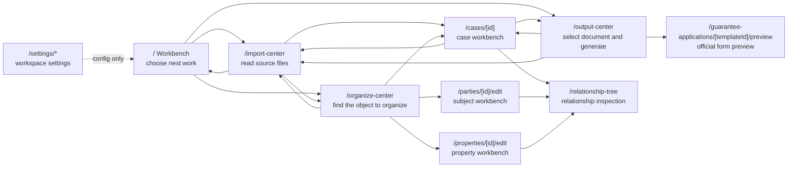
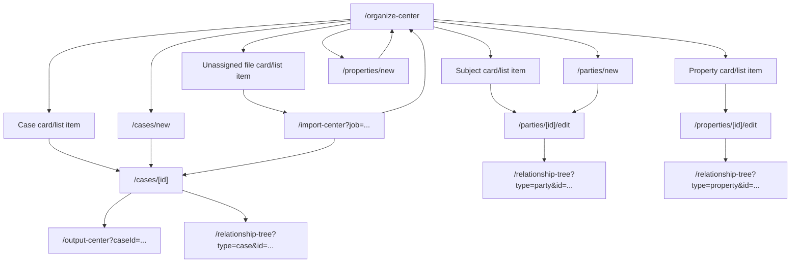
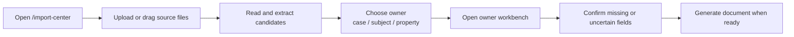
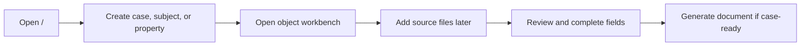
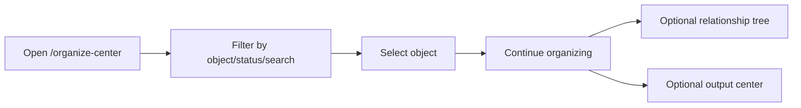

# Product Topology

## Positioning

Broker Desk is a fast business workbench for small Japan real estate brokerage teams that currently rely on heavy Excel workflows.

It is not primarily:

- a CRM
- a property management system
- a generic OCR tool
- a PDF generator
- an AI agent that decides facts automatically

The product replaces repetitive Excel work by turning scattered source files into structured, editable, reviewable, and reusable case data, then using that data to produce standard business documents.

AI is not a separate frontstage product. AI is an operator inside this workbench: it reads source files, proposes candidates, highlights uncertainty, prepares outputs, and learns from user-confirmed corrections through product-owned memory.

## AI Agent Boundary

Broker Desk should not present AI as an upgraded RPA script.

RPA automates stable actions in stable interfaces: click, copy, paste, submit. Broker Desk AI is valuable only when it handles work that fixed automation cannot reliably handle:

- understand the business meaning of messy source files
- identify whether a document belongs to a case, subject, property, or unassigned intake
- extract structured candidates from Excel, PDF, scans, and photos
- compare values across sources and expose conflicts
- separate confirmed facts from candidates, unknowns, and user-filled missing values
- prepare output-specific suggestions without polluting reusable case data
- produce auditable proposals that a broker can accept, edit, reject, or leave unresolved

The product-level AI shape is:

```text
Real-estate data assistant
  -> skills for bounded tasks
  -> tools for product actions
  -> agent workflow for goal-directed, audited, human-approved execution
```

Definitions:

- `Skill`: a bounded capability such as document extraction, field matching, conflict detection, or PDF-template pre-match.
- `Tool`: a product action such as read case, create candidate fields, save review decision, generate draft output, or open template preview.
- `Agent`: a controlled workflow that knows the user's goal, gathers product context, calls skills/tools, proposes changes, and waits for approval before durable writes.

The model is not the memory system. Broker Desk's own database is the memory system:

- subjects
- properties
- cases
- source files and OCR/extraction results
- field decisions and correction events
- user-confirmed values
- rejected suggestions
- template bindings and approved experience notes
- tenant/user preferences and permission rules

External models may be stateless. Broker Desk must remain stateful by retrieving the relevant product memory before each AI task and by writing auditable events after user confirmation.

## Product Value Map

### 1. Convenience Layer: Input

Input is the entry convenience.

It reduces repetitive typing by importing or extracting from existing Excel/PDF/source files.

Input value:

- auto-detect known templates
- extract candidate fields
- preserve source evidence
- mark uncertainty
- use AI only as assistive suggestion

Input is not the product center. It feeds the workbench.

### 2. Core Work Layer: Case Workbench

The case workbench is the product center.

It is the structured replacement for the broker's Excel workbook.

Workbench value:

- grouped business fields
- direct editing
- missing field tracking
- AI candidate review
- conflict resolution
- source evidence lookup
- search across case facts, aliases, values, and source files
- issue queues for missing, candidate, conflicting, stale, and recently imported facts
- case-level confirmed data

This is where the broker actually works after input and before output.

If this layer is weak, the product becomes a file uploader plus PDF printer and loses its core positioning.

### 3. Convenience Layer: Output

Output is the exit convenience.

It turns confirmed workbench data into official or standard templates.

Output value:

- select standard template
- auto-fill only certified-safe fields from confirmed data
- show candidate values on the editable official-form preview
- let users electronically complete non-certified fields on the form surface
- show missing required fields
- preserve official format
- export/print ready PDF

Output must not read raw extraction data or unaccepted AI suggestions. It should consume only confirmed case data and saved output draft values. It must also distinguish confirmed business data from fields that are certified safe to auto-print on a specific official PDF template.

### 4. Backstage Layer: AI Correction Learning

AI correction learning is the hidden improvement loop.

It converts normal broker review actions into durable product knowledge:

- AI/rule candidate snapshot
- user-confirmed snapshot
- deterministic diff
- correction event
- scoped experience update
- regression sample when needed
- retrieval context for the next AI task

This layer should not create extra work for the broker. The frontstage action is still edit, save, proceed, preview, and export.

Learning value:

- reduce repeated extraction mistakes
- distinguish AI errors from user-filled missing data
- remember template-level PDF adjustments
- capture long-text and split-field failures
- build regression cases from real user corrections
- make model behavior improve through Broker Desk's state, not through model private memory

## Topology

```text
Source Files
  -> Input Extraction
    -> Review Signals
      -> Case Workbench
        -> Confirmed Case Data
          -> Output Draft
            -> Official PDF / Print
              -> Correction Events / Experience Updates
```

## Current Page Topology (2026-07-23)

This section describes the current route-level product map. It is the working reference for UX and routing changes.

The product has one frontstage spine:

```text
Workbench -> Input Center -> Organize Center -> Object Workbench -> Output Center
```

The app should not create parallel chains for the same broker job. A page can be powerful, but its role in the chain must be narrow.

### Frontstage Route Graph



Route contract:

- `/` is the decision surface. It answers "what should I do next?" and routes to one of the three production steps.
- `/import-center` is the source-reading surface. It imports files, shows extracted candidates, and routes the user back to the chosen owner or to `整理信息`.
- `/organize-center` is the object index. It is where the user chooses whether the next work target is a case, subject, property, or unassigned file.
- `/cases/[id]`, `/parties/[id]/edit`, and `/properties/[id]/edit` are the object workbenches. They are the only places where "continue organizing" should perform deep object editing.
- `/output-center` is the document production surface. It consumes confirmed case data and output drafts; it does not own raw extraction review.
- `/relationship-tree` is an inspection surface. It explains how one selected object connects to other objects, source files, and outputs. It should not become another editing flow.
- `/settings/*` is configuration only. It must not contain ordinary broker execution tasks.

### Main Navigation Layers

```mermaid
flowchart TB
  Nav["Main sidebar"]
  Home["Workbench"]
  Import["Input Center"]
  Organize["Organize Center"]
  Output["Output Center"]

  SettingsNav["Workspace Settings"]
  Members["Team Members"]
  Required["Required Fields"]
  OutputHeader["Document Header / Output Templates"]

  Secondary["Secondary / legacy routes"]
  Parties["/parties subject ledger"]
  Properties["/properties property ledger"]
  Quotes["/quotes legacy quote pages"]
  Contracts["/contracts legacy contract pages"]
  Service["/service-requests legacy request pages"]

  Nav --> Home
  Nav --> Import
  Nav --> Organize
  Nav --> Output

  SettingsNav --> Members
  SettingsNav --> Required
  SettingsNav --> OutputHeader

  Secondary --> Parties
  Secondary --> Properties
  Secondary --> Quotes
  Secondary --> Contracts
  Secondary --> Service
```



Layer rules:

- Main sidebar links are the user-facing product chain.
- Settings links configure the chain; they do not execute the chain.
- Secondary / legacy routes may remain available while V1 stabilizes, but they should not define the default user mental model.
- If a secondary page has a useful function, it should either be folded into the main chain or clearly positioned as a reference ledger.

### Object Flow Contracts

The user-facing objects are:

- `Case`: one concrete brokerage workflow, such as a rental application, sale inquiry, or guarantee application.
- `Subject`: one reusable person or company.
- `Property`: one reusable property/building/room record.
- `Unassigned Intake`: read files that do not yet have a confirmed owner.



Current implementation notes:

- Existing case, subject, and property records now have aligned "continue organizing" destinations:
  - case -> `/cases/[id]`
  - subject -> `/parties/[id]/edit`
  - property -> `/properties/[id]/edit`
- Subject creation can land in the subject workbench after save.
- Property creation currently saves back to `整理信息` or the property ledger, then the user opens the property workbench. This should be unified so the primary save path enters `/properties/[id]/edit`.
- `Unassigned Intake` should always return to ownership assignment or the selected owner workbench after the user chooses where the file belongs.

### Page Responsibility Matrix

| Page | User question | Allowed work | Should not do |
| --- | --- | --- | --- |
| `/` | What should I do now? | Show the main production steps, priority assistant, global search | Deep editing, full tables, diagnostics |
| `/import-center` | What file do I want the system to read? | Upload/read files, show extraction result, choose owner, route to review | Long-term object management, output readiness |
| `/organize-center` | Which object needs attention? | Search, filter, paginate, choose case/subject/property/file | Duplicate object editing styles, output generation |
| `/cases/[id]` | What is missing from this case? | Edit case facts, review candidates, check relationships, prepare output-specific draft | Raw upload as primary task, unrelated object ledger browsing |
| `/parties/[id]/edit` | What is missing from this subject? | Edit subject facts, view progress, inspect relationships | Separate CRM workflow, output generation |
| `/properties/[id]/edit` | What is missing from this property? | Edit property facts, view progress, inspect relationships | Separate property-management workflow |
| `/output-center` | Which document can I generate? | Select case/template, check missing items, preview/export | Raw extraction review, editing unrelated fields |
| `/relationship-tree` | How are these objects connected? | Inspect object graph and jump to the relevant object | Become another editing page |
| `/settings/members` | Who can use the workspace? | Team and permission configuration | Broker data execution |
| `/settings/case-workbench-fields` | Which fields matter for this tenant? | Required/optional field settings | Case-by-case data entry |
| `/settings/output-templates` | What document header/template rules apply? | Output template/header configuration | Generating one specific document |

### Primary User Journeys

#### A. Start With Files



#### B. Start Without Files



#### C. Find Existing Work



### Topology Risks To Resolve

These are not blockers for the current map, but they should be kept visible:

- Property creation should route directly to the property workbench on the primary save path.
- Subject creation still uses an older profile form while subject editing uses the new object workbench shell.
- Secondary ledgers (`/parties`, `/properties`) must remain clearly positioned as search/reference pages, not as competing edit pages.
- Output Center still contains legacy quote/property-overview paths. If they remain user-facing, their routes and wording must be aligned with the main case-output flow.
- Legacy pages such as `/quotes`, `/contracts`, `/service-requests`, `/templates`, `/clients`, and `/audit-log` should be hidden, merged, or explicitly marked as backstage before release.
- The relationship tree needs a consistent "open workbench" action for case, subject, property, file, and output nodes.
- Any action label pair such as `Open` vs `Edit` must be collapsed into one product meaning per object state.

## Ownership-First Intake

Broker Desk should not treat raw upload as the primary work start.

The product's main operating unit is the `Case`. A case binds reusable subjects, reusable properties, source files, confirmed case facts, output artifacts, and execution state for one concrete brokerage workflow.

The correct intake rule is:

```text
Choose or create ownership
  -> upload / read source files
    -> review extracted candidates
      -> save confirmed facts to the chosen owner
        -> use case data for outputs and execution tracking
```

Valid ownership targets:

- `Case`: rental application, rental mandate, sale mandate, quote preparation, contract workflow, renewal, cancellation, or other business operation.
- `Subject`: reusable person or company records such as applicant, owner, guarantor, tenant, buyer, seller, broker, or management company.
- `Property`: reusable property records such as building, room, address, rent, fees, ownership, and management information.
- `Unassigned Intake`: temporary holding space for files whose owner is unclear.

Product rules:

- Files without a chosen owner must stay in `Unassigned Intake`.
- Unassigned files may be detected and previewed, but must not write confirmed facts into subject, property, or case records.
- The `整理信息` entry must be an object center, not a case-only list. Users should be able to start from a case, subject, property, or unassigned file, then attach missing relationships later.
- Creating a `Subject` must open a profile workflow. It must not silently create a usable record with placeholder phone numbers, fake purposes, or inferred roles.
- Subject profile drafts may auto-save locally while the user is typing, but drafts must not participate in output autofill until the user explicitly saves the subject.
- Multi-file merge is allowed only inside one chosen owner and only when key identity or property facts do not conflict.
- Drag-and-drop can help assign files to a case, subject, or property, but explicit business roles still require structured fields.
- Quotes, guarantee applications, contracts, and future documents are output artifacts under a case, not standalone data islands.
- Generated output artifacts must keep snapshots of the data used at generation time so later edits do not rewrite historical quotes or contracts.

## Organize Center Rule

`整理信息` is the broker's object index and editing entry. It should not force every record into a case before the business relationship is known.

Top-level work objects:

- `Subject`: person or company records such as applicants, owners, guarantors, buyers, sellers, brokers, and management companies.
- `Property`: reusable property records such as building, room, address, rent, fees, owner, and management context.
- `Case`: a concrete business workflow that connects subjects, properties, files, and future outputs.
- `Unassigned Intake`: source files that have been read but do not yet have a confirmed owner.

Default behavior:

- New subject and new property actions open their own editing workflows.
- New case action opens an empty case workbench with the normal field structure already present.
- Upload actions may happen before or after ownership is chosen, but unassigned uploads must remain in the intake queue until assigned.
- The object list must support type, status, and search filters before data volume becomes large.
- Output readiness belongs in output workflows, not as the primary organizing model of `整理信息`.

2026-06-27 implementation checkpoint:

- The app now has a first object-center scaffold for cases, subjects / related parties, properties, and unassigned intake.
- The homepage has been redirected away from "today's tasks" toward a data relationship center.
- New case, subject, and property paths now open object-specific creation flows.
- This is not yet the final interaction design. The next product pass must reduce density, remove remaining internal concepts from ordinary screens, and make the first action path obvious within a few seconds.

Expanded:

```text
Excel / PDF / Paper Scan
  -> deterministic template detection
  -> extraction candidates
  -> AI assist for uncertainty, normalization, conflict hints
  -> human review
  -> editable case workbench
  -> confirmedDataJson / future stable case fields
  -> guarantee application draft
  -> fixed official PDF overlay
  -> user corrections saved as scoped AI learning context
```

## Feature Priority Rule

When deciding priority, use this order:

1. Does it strengthen the workbench as an Excel replacement?
2. Does it reduce manual re-entry or manual checking?
3. Does it make uncertain/missing/conflicting data easier to review?
4. Does it improve reuse of confirmed case data?
5. Does it make a standard output faster or more reliable?
6. Does it convert confirmed user corrections into reusable product knowledge without increasing broker workload?

Do not prioritize features that only add modules without strengthening the input -> workbench -> output chain.

## Current V1 Product Spine

V1 should now focus on this spine:

1. Known input templates can be imported and extracted.
2. Extracted values enter a reviewable state.
3. User can work in an editable case workbench.
4. Workbench shows confirmed, edited, AI-suggested, missing, conflicting, rejected, and unknown states.
5. Workbench organizes reusable case facts as a case dossier; output readiness is calculated inside each output workflow from confirmed workbench data plus output draft state.
6. `ふれんず保証` can export certified-safe fields from confirmed case data and candidate/manual fields after preview confirmation.
7. Save/proceed/export actions produce correction events when AI/rule candidates differ from confirmed user results.
8. Other guarantee templates can be added after the workbench spine is solid.

## V1 Chain Acceptance

The first product milestone is not "many inputs" or "many outputs".

The milestone is one complete three-step chain:

1. Input OK
2. Edit / organize / summary workbench OK
3. Output OK

Only after this chain is convincing should input and output be copied outward to more source files and more guarantee company templates.

### Input OK

Input is acceptable when:

- known source files can be imported
- candidate values are extracted
- source evidence is preserved
- uncertainty is marked
- AI suggestions are separated from confirmed facts
- the user can move extracted data into the workbench

### Edit / Organize / Summary Workbench OK

The workbench is acceptable when:

- confirmed case data is visible in business groups
- user can edit and save fields
- missing fields are visible
- AI candidates and low-confidence fields are visible
- conflicts are visible
- case facts can be confirmed without starting an output workflow
- output readiness is checked in the relevant output workflow, not as the organizing center of the workbench

### Output OK

Output is acceptable when:

- a selected official template consumes confirmed workbench data
- missing required data is not fabricated
- only certified-safe fields are auto-printed without preview confirmation
- candidate/manual fields can be completed electronically on the official form surface
- official template background is preserved
- PDF is readable and exportable
- no-case and invalid-case exports are blocked
- regression covers the happy path and safety paths

## Near-Term Roadmap

### Phase A: Close The Workbench Gap

Goal:

Make the case workbench the visible operating surface.

Must include:

- grouped editable fields
- selected guarantee company target
- field status badges
- default attention-first view for missing, uncertain, unknown, conflicted, or AI-candidate fields
- output-required and all-field filters
- AI candidate state
- source evidence access at the field level
- explicit user decisions for use value / leave unknown / reject candidate
- save back to confirmed case data
- guarantee application readiness summary

Current implementation baseline:

- The case page defaults to the fields that need broker attention instead of rendering the full Excel-like field set first.
- Required and attention fields are calculated against the selected guarantee company template, not the union of every template.
- Output-center links preserve the selected template when returning to the workbench.
- Brokers can switch to output-required fields or all fields when needed.
- Each visible field can be edited and marked as usable, unknown, or rejected.
- High-frequency fields now use business-aware controls: select options, phone/email inputs, date placeholders, money/number units, and address text areas.
- Visible AI candidates with values can be confirmed in one save action.
- Saving a confirmed visible value changes its trust state to confirmed instead of leaving it stuck as an AI candidate.
- Field-level source evidence now has an action-oriented summary: candidate value, source location, method, confidence, and guidance before the detailed disclosure.
- A broker can confirm or adopt a field candidate directly from the evidence summary.
- Longer correction history remains secondary.
- Workbench review queues now prioritize the current selected guarantee application: application-blocking fields first, then trusted candidates, low-confidence items, and required fields with no source candidate.
- This queue order is a V1 guarantee-application rule, not a permanent global priority model for future business workflows.

### Phase B: Guarantee Application Draft

Goal:

Add an output-specific completion layer between case data and PDF.

Must include:

- selected guarantee company
- required field checklist
- manual company-specific fields
- draft save
- export readiness

Current implementation baseline:

- The company-specific draft is now edited inside the case workbench before PDF preview.
- Draft fields are template-scoped, so each guarantee company can expose only its own options and consent/check fields.
- Draft save writes `GuaranteeApplicationDraft`; it must not write template-only choices into reusable case facts.
- The workbench distinguishes common missing fields from company-specific missing draft fields.
- The frontstage sequence should read as one production line: `資料を入れる` -> `足りない項目だけ確認` -> `会社別草稿` -> `申込書プレビュー` -> `PDF`.
- Draft readiness and saved-at state should be visible in the workbench, output center, and preview page.
- Company-specific missing fields should navigate to the workbench draft layer, while the preview page remains available for final form-surface correction.
- Draft saves now feed `CorrectionEvent` with trigger `guarantee_draft_save`, so repeated company-option corrections can become output-template scoped experience drafts.

### Phase C: AI Correction Learning Spine

Goal:

Turn normal review/save/export moments into durable AI improvement evidence.

Must include:

- extraction snapshot vs confirmed snapshot
- correction event classification
- source evidence and field scope
- template output correction events
- experience update draft
- promotion rules that prevent one-off edits from becoming global rules
- regression sample creation for official output failures

Current implementation baseline:

- Correction events are emitted from extraction review save, case workbench save, guarantee company draft save, and editable PDF preview save.
- Repeated same-scope corrections generate gated AI experience drafts; one-off/case-only events do not promote automatically.
- Approved-only experience retrieval is available for future AI prompt assembly.

### Phase D: One Template To Production Quality

Goal:

Make `ふれんず保証` broker-usable.

Must include:

- official template fidelity
- readable Japanese font rendering
- reliable coordinates
- no blank no-case export
- stable happy-path regression
- manual visual QA checklist

Current implementation baseline:

- `ふれんず保証` is the default production-quality template target.
- Direct PDF download is guarded by a shared download gate covering common required fields, company draft required fields, template quality, unconfirmed candidate overlay fields, manual unplaced fields, and print-fit blockers.
- `ふれんず保証` print-fit and calibration regression now cover the actual 79-field overlay set instead of a different company template.
- Visual smoke compares generated output against the official source background and requires visible fill deltas in critical regions.

### Phase E: Expand Templates

Goal:

Add the remaining four guarantee companies only after the workbench and one-template path are stable.

Order:

1. ふれんず保証
2. インシュア
3. Jリース
4. 日本セーフティー
5. 全保連

Reason:

Start from simpler/readable one-page templates, then move to harder scanned/garbled templates.

Current implementation baseline:

- The remaining four templates now have active overlay configs and shared direct-download gating.
- Phase E uses `certified minimum output`, not full automatic completion. Only fields that passed normal-sample fit checks are certified for automatic final printing.
- `assisted_candidate` fields are visible on the editable official-form preview and require preview confirmation before final PDF printing.
- `manual_electronic` fields remain easy to complete on the form surface but are not inferred or printed automatically.
- `日本セーフティー` uses a high-resolution official-source raster background because direct overlay text on the downloaded PDF was not visually reliable.
- Regression now covers all five active templates for calibration ledger, print fit, autofill policy, download gate, PDF page fidelity, direct download, and visual smoke.
- PDF coordinate and field-binding work is now treated as an internal template factory, not a broker-facing feature. See `docs/product/PDF_TEMPLATE_AUTHORING_EXPERIENCE.md`.
- Template fields should bind to semantic case fields plus deterministic transforms, so output templates improve without exposing micro-field maintenance to users.

## PM Guardrails

- Input and output are convenience surfaces; the workbench is the product center.
- AI is an assistant for attention, uncertainty, and suggestions, not final truth.
- AI improvement belongs to Broker Desk's correction events, scoped memories, and regression cases, not to the model's private memory.
- Official output templates must remain unchanged.
- Users should review problem fields first, not manually re-check every field.
- The product should feel like a faster structured Excel, not a technical configuration system.
- Every new feature must strengthen the same topology instead of creating a side module.
- PDF calibration, coordinate maps, field bindings, and segment-cell settings are backstage template-authoring assets. They should eventually live behind PM/admin access and should not define the ordinary broker workflow.

## Frontstage Simplification Rule

The default user-facing product must feel like a service counter, not an admin system.

The broker's first-screen mental model should be:

```text
1. 資料を入れる
2. 足りない項目だけ確認する
3. 保証会社申込書を出す
```

All complex capabilities still exist, but they belong behind the main flow:

- field mapping
- import diagnostics
- extraction logs
- source evidence tables
- full field inventory
- output readiness matrices
- template registry details
- internal schema names
- company PDF source filenames

These details should be hidden by default under secondary sections such as `詳細`, `確認ログ`, or `高度な設定`.

### Default Screen Acceptance

For `/`, `/import-center`, `/cases/[id]`, and `/output-center`, the first viewport must answer only four broker questions:

1. What am I doing now?
2. What is missing?
3. What can the system already do for me?
4. What is the next button?

If the screen requires the user to understand mapping, schema, module structure, logs, or readiness math before acting, it fails the V1 product direction.

### Layout Priority

The default layout priority is:

1. current task and selected case
2. one primary next action
3. missing or uncertain items only
4. generated output availability
5. detailed workbench / evidence / diagnostics collapsed below

The app may keep deeper workbench power, but the broker should not meet it until they ask for detail or need to fix a specific missing item.

## Anti-Salesforce Frontstage Rule

The customer-facing product must not feel like a large SaaS system.

Frontstage user experience should be a service flow:

1. 資料を入れる
2. 足りない項目だけ確認する
3. 申込書を出力する

Backstage complexity may include extraction, AI suggestions, field normalization, source evidence, workbench data, draft state, template coordinates, PDF fidelity, and regression checks. These should not be presented as separate first-level user modules.

### What To Hide By Default

Hide or demote by default:

- field mapping UI
- import diagnostics
- trend panels
- audit/log panels
- broad module navigation
- large readiness card grids
- full field tables
- technical source/file names
- internal data concepts such as confirmedDataJson, schema, coordinates, raw keys

### What To Show By Default

Show by default:

- current task
- selected guarantee company
- selected case
- remaining required items
- next action
- download availability

The broker should understand the next action within ten seconds.

### Frontstage MVP Shape

The main screen for V1 should be:

```text
保証会社申込書を作成

Step 1: 資料を入れる
Step 2: 不足項目を確認
Step 3: PDFを出力
```

The detailed workbench remains available as an advanced/editing surface, but the default path should guide the user only to unresolved items and output readiness.
