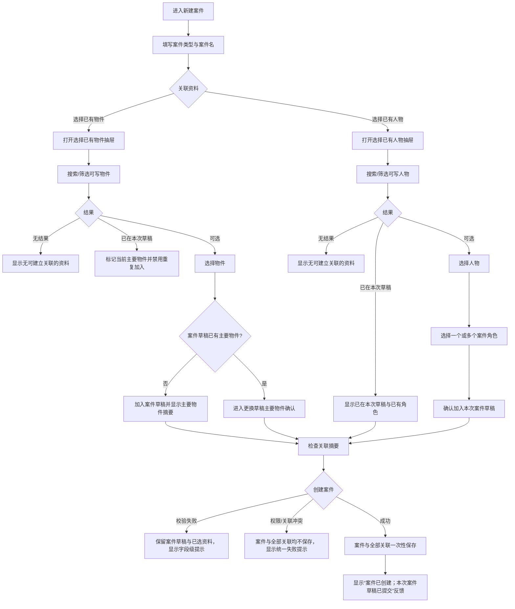
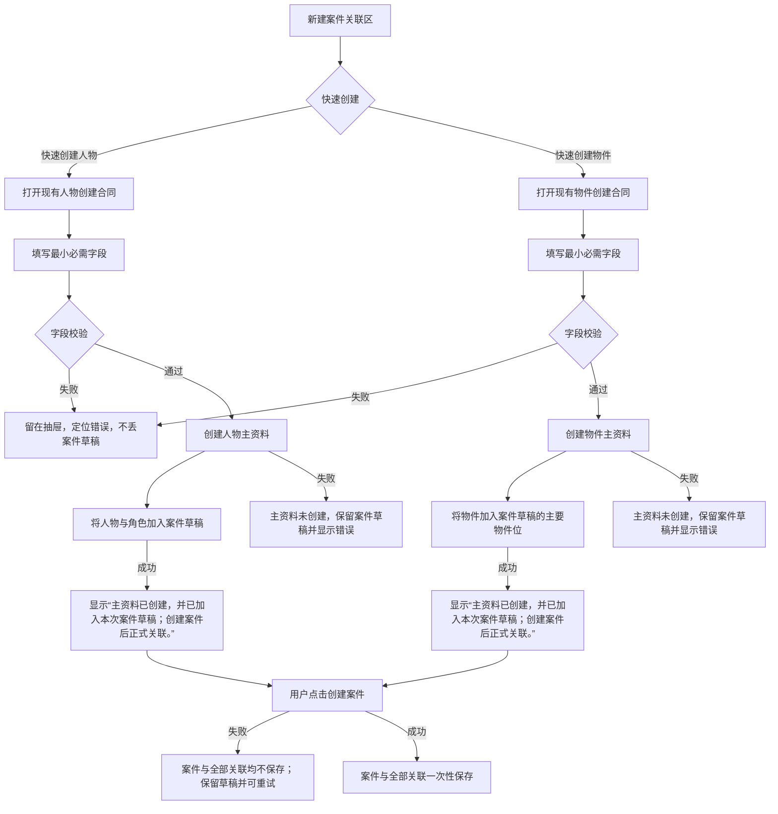
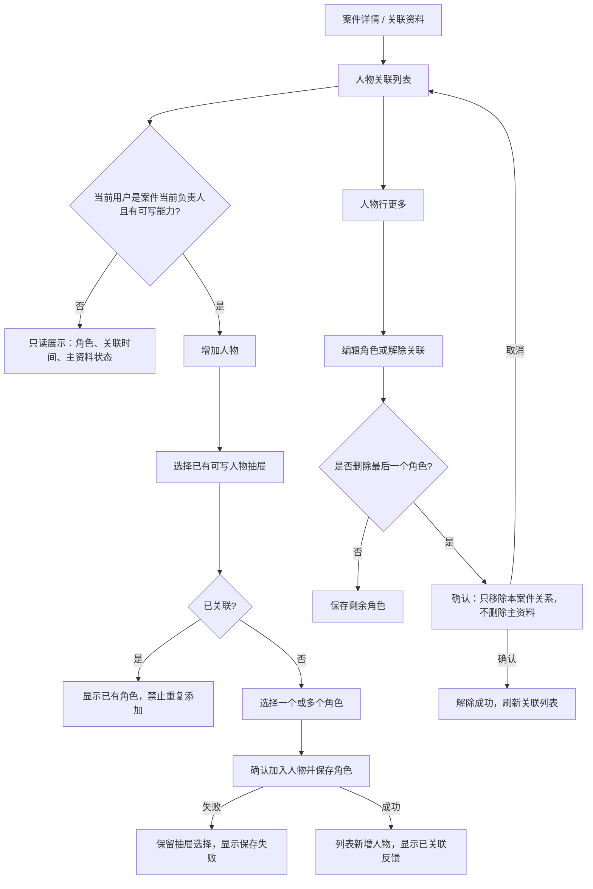
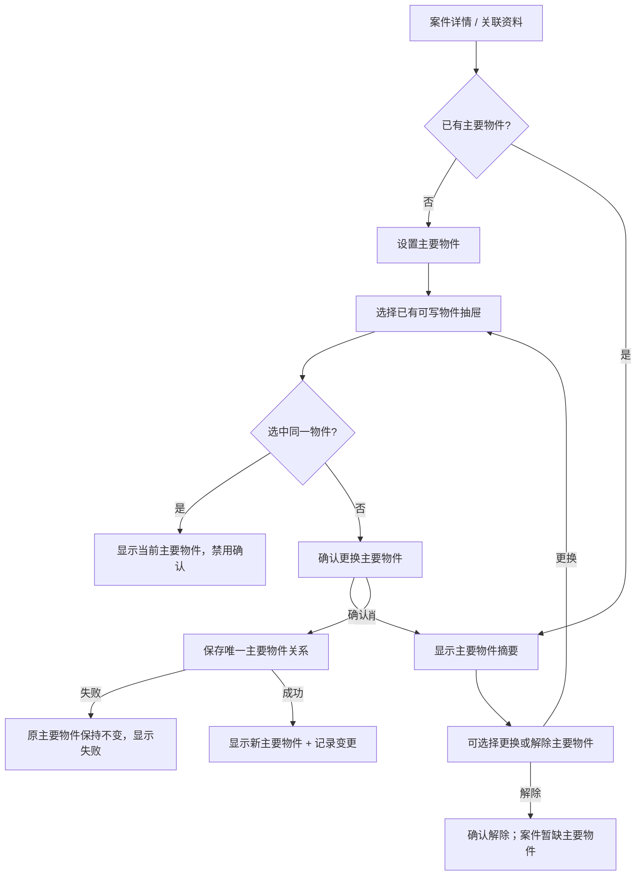

# 用户流程图

图中“可关联候选”指当前 session 下当前用户拥有可写能力的人物/物件；资料是“仅自己可见”还是“公司成员可见／只读”不改变本人候选资格。其他成员仅有公司成员可见／只读的资料在候选源头被过滤，不进入后续步骤。图中的“草稿”表示案件尚未创建前的页面内待保存状态，不表示关系已经落库。

## 1. 创建案件：选择已有资料

## 2. 创建案件：快速创建并加入案件草稿

新建案件页的快速创建必须区分“主资料创建”和“案件正式关联”两个时间点：

1. 主资料创建成功，并加入本次案件草稿；
2. 用户创建案件成功，案件与全部关联一次性保存。

第一阶段反馈固定为“主资料已创建，并已加入本次案件草稿；创建案件后正式关联。”。用户取消案件时，独立主资料保留。新建案件创建失败时，不产生部分案件关联，保留页面草稿并允许重试；主资料不自动删除。

已有案件详情的快速创建仍是两阶段：先创建主资料，再写入案件关联。关联失败时显示“主资料已创建，但案件关联未保存”，保留主资料并提供重试，不自动删除。

## 3. 整理已有案件：人物关联

## 4. 整理已有案件：主要物件

## 5. 跨流程状态规则

- 任一 drawer/全屏层打开后焦点锁定在层内；Tab/Shift+Tab 不逃逸，Enter 执行当前控件，Esc 等价于取消，不等价于保存；关闭后焦点回到打开它的按钮。
- 保存期间按钮进入 loading，避免重复提交；失败不清空已选内容。
- 详情刷新后以服务端结果为准；客户端暂存只用于恢复表单，不用于授权。
- 其他成员仅有“公司成员可见／只读”的资料可在已有合法关联详情中按只读状态显示，但不进入“选择已有”候选；这不是“搜索不到”，而是“当前动作不可建立关系”。
- 新建案件页底栏固定动作不能遮挡草稿摘要、错误或抽屉确认；窄屏全屏层的滚动内容必须预留底栏高度，背景底栏在层打开时不可误触。
